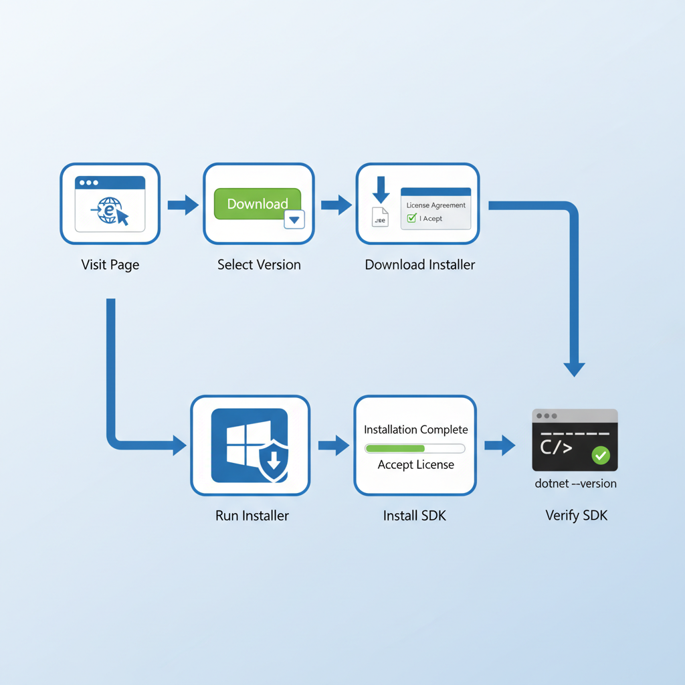

# Step-by-Step Guide: Downloading and Installing the .NET SDK

The .NET SDK (Software Development Kit) is the cornerstone of .NET development. It provides the necessary tools, compilers, and libraries to build, test, and deploy .NET applications. This section will walk you through the process of acquiring and installing the latest stable version of the .NET SDK.
What is the .NET SDK?

## The .NET SDK includes:

 - The .NET Runtime: This is what allows you to run .NET applications.
 - The .NET CLI (Command-Line Interface): A powerful set of commands for creating, building, running, and publishing .NET applications.
 - Compilers: Such as the C# compiler (Roslyn).
 - Development Libraries: Essential frameworks and APIs for building various types of applications.

It's crucial to install the SDK that supports the versions of .NET you intend to work with. For this course, we will focus on the latest Long-Term Support (LTS) version, which offers stability and extended support.

## Why is Installing the .NET SDK Important?

Without the .NET SDK, you cannot compile your C# code, run .NET applications, or utilize the .NET CLI for project management. It is the fundamental prerequisite for any .NET development activity.

### Downloading the .NET SDK

1. Navigate to the Official .NET Download Page: Open your web browser and go to the official Microsoft .NET download page. You can typically find this by searching for "Download .NET SDK" or by visiting https://dotnet.microsoft.com/download.

2. Select the Latest LTS Version: On the download page, you will see different versions of .NET. Look for the latest Long-Term Support (LTS) release. LTS releases are recommended for production environments due to their extended support lifecycle and stability. As of this writing, .NET 8 is the latest LTS version. You will also see Current releases, which offer the newest features but have shorter support periods.

3. Choose Your Operating System: Select the installer appropriate for your operating system (Windows, macOS, or Linux). For Windows, you will typically download an executable file (.exe).
Installing the .NET SDK on Windows

1. Run the Installer: Once the download is complete, locate the downloaded .exe file and double-click it to start the installation wizard.

2. Accept License Terms: Read through the license agreement and click the Install button to proceed. You may need administrator privileges to install software on your system.

3. Installation Progress: The installer will display the progress of the SDK installation. This process typically takes a few minutes.

4. Completion: Upon successful installation, you will see a confirmation message. Click Close to exit the installer.

### Post-Installation Verification

After the installation is complete, it's essential to verify that the SDK has been installed correctly and is accessible from your command line.

1. Open Command Prompt or PowerShell: Search for 'cmd' or 'PowerShell' in your Windows search bar and open it.

2. Run the Version Command: Type the following command and press Enter:

    `dotnet --version`

If the installation was successful, you should see the version number of the .NET SDK you just installed printed in the console. For example, you might see something like 8.0.100.

If you encounter an error like 'dotnet' is not recognized as an internal or external command, it means the .NET SDK's installation directory was not added to your system's PATH environment variable. In most cases, the installer handles this automatically. If not, you may need to manually add the SDK's 'bin' directory to your system's PATH. However, this is rare with standard installations.
Real-World Scenario: Setting up for a New Project

Imagine you've just joined a new company or started a freelance project that uses .NET. The very first thing you'll do is ensure you have the correct .NET SDK installed. This lesson provides the exact steps to do that, ensuring you're ready to clone the project's repository and start contributing immediately. Having the right SDK version is critical for compatibility with the project's dependencies and build configurations.

# Guided Installation: Visual Studio 2022 Community Edition

Visual Studio 2022 is a comprehensive Integrated Development Environment (IDE) from Microsoft, offering a rich set of tools for developing applications across various platforms, including .NET. For beginners and individual developers, the Community Edition is free and provides nearly all the features of the professional versions.

### What is Visual Studio?

Visual Studio is more than just a code editor. It's a full-fledged IDE that includes:

 - Code Editor: With syntax highlighting, IntelliSense (code completion), and refactoring tools.
 - Debugger: For stepping through code, inspecting variables, and identifying bugs.
 - Designer Tools: For visually designing user interfaces (e.g., for WPF, WinForms, ASP.NET).
 - Project Management: Tools for organizing your code, managing dependencies, and building projects.
 - Version Control Integration: Built-in support for Git.
 - Extensibility: A vast marketplace for extensions that add even more functionality.

### Why Visual Studio Community Edition?

The Community Edition is ideal for this course because it's:

 - Free: No cost for individual developers, open-source projects, academic research, and educational use.
 - Feature-Rich: Provides a professional development experience.
 - Industry Standard: Widely used in the .NET development community.

### Downloading Visual Studio 2022

1. Visit the Visual Studio Website: Open your web browser and go to the official Visual Studio download page. Search for "Download Visual Studio" or navigate to https://visualstudio.microsoft.com/downloads/.

2. Select Community Edition: Under the "Free tools for individuals, open source, and academic use" section, find Visual Studio Community 2022 and click the Free download button.

3. Download the Installer: This will download a small bootstrapper file (e.g., 'vs_community.exe').
Installing Visual Studio 2022

1. Run the Bootstrapper: Locate the downloaded file and double-click it to launch the Visual Studio Installer.

2. Initial Setup: The installer will prepare the necessary files. You may be prompted to accept license terms and privacy statements.

3. Select Workloads: This is a critical step. The installer presents "Workloads," which are pre-selected sets of tools and components for specific development scenarios. For our course, the most important workload is:

   - ASP.NET and web development: This includes tools for building web applications with ASP.NET Core, which is fundamental for full-stack .NET development.
   - .NET desktop development: While not strictly required for web development, it's useful for understanding C# fundamentals and building desktop applications if needed.

#### Crucially, ensure the following components are selected within your chosen workloads:

   - .NET SDK (latest version): The installer will usually detect and offer to install the .NET SDK if it's not already present. Make sure the correct version is selected.
   - .NET Core cross-platform development: Essential for building modern .NET applications.
   - ASP.NET Core Razor Pages Support
   - Entity Framework Core tools
   - Git for Windows (if not already installed)

You can customize the installation further by clicking on the Individual components tab in the installer, but the workloads usually cover most needs.

4. Choose Installation Location: You can accept the default installation location or choose a different drive if you have space constraints or prefer to keep development tools separate.

5. Begin Installation: Click the Install button. Visual Studio will download and install all selected components. This process can take a significant amount of time, depending on your internet speed and the number of workloads selected.

6. Restart (if prompted): After the installation is complete, you might be asked to restart your computer. It's generally a good practice to do so.

### First Launch and Sign-in

Once installed, launch Visual Studio 2022. You will be prompted to sign in with a Microsoft account. Using a Microsoft account is recommended as it allows you to sync your settings across different machines and access certain features.

## Real-World Scenario: Setting up a New Development Machine

Imagine you're setting up a brand-new laptop for your first day at a .NET development job. This section provides the exact, step-by-step instructions to download and install Visual Studio Community Edition, ensuring you select the correct components (workloads) needed for ASP.NET Core development. This prevents common issues like missing SDKs or incorrect framework versions, allowing you to be productive from day one.

# Understanding Visual Studio Workloads and Components

Visual Studio's installer uses the concept of Workloads to simplify the installation process. A workload is a curated collection of related tools, SDKs, and components tailored for a specific type of development. Understanding these workloads is key to ensuring you install only what you need, saving disk space and reducing installation time.

## What are Workloads?

Instead of manually selecting hundreds of individual components, Visual Studio groups them into logical workloads. For example, the 'ASP.NET and web development' workload includes everything you need to build web applications, such as the ASP.NET Core runtime, web development tools, and relevant SDKs.

## Common Workloads for .NET Development

Here are some of the most relevant workloads for this course and general .NET development:

   - ASP.NET and web development: This is essential for building web applications using ASP.NET Core, Blazor, and related technologies. It includes the .NET Core SDKs, IIS Express, and web development tools.
   - .NET desktop development: Includes tools for building Windows desktop applications using WPF, Windows Forms, and .NET MAUI. While our focus is full-stack, understanding C# fundamentals often starts with desktop applications.
   - Universal Windows Platform development: For building apps that run on Windows 10/11 devices.
   - Mobile development with .NET: For building cross-platform mobile applications using .NET MAUI.
   - Game development with Unity: If you're interested in game development using the Unity engine with C#.
   - Azure development: Tools for developing and deploying applications to Microsoft Azure cloud services.
   - .NET Core cross-platform development: This is often included as a core component within other workloads but can also be selected individually. It ensures you have the necessary SDKs and runtimes for building cross-platform applications.

### The 'Individual Components' Tab

While workloads are convenient, the Individual components tab in the Visual Studio Installer gives you granular control. Here, you can:

   - Install specific .NET SDK versions: If you need to target older projects or experiment with preview versions.
   - Add specific runtimes: Such as the .NET Desktop Runtime or .NET Core Runtime.
   - Install development tools: Like Git for Windows, NuGet package manager, or specific language compilers.
   - Select SDKs and build tools: For different frameworks like .NET Framework, .NET Core, or .NET 5+.

### Selecting the Right Components for This Course

For our Full Stack .NET Development course, the primary focus is on web development. Therefore, you should prioritize:

1) ASP.NET and web development workload: This is non-negotiable.
2) .NET SDKs: Ensure the latest LTS version (e.g., .NET 8) is installed. The installer usually handles this within the workload.
3) .NET Core cross-platform development: This is often a dependency of the ASP.NET workload.
4) Git for Windows: Essential for version control, which we will use extensively.

You can explore other workloads later if your interests expand, but for now, focus on the web development stack.

### Why is Understanding Workloads Important?

   - Efficiency: Installing only necessary components saves significant disk space and installation time.
   - Troubleshooting: Knowing which components belong to which workload helps in diagnosing installation issues or missing features.
   - Customization: Allows you to tailor your environment precisely to your project needs, avoiding bloat.
   - Version Management: Helps in managing multiple .NET SDK versions if required for different projects.

### Real-World Scenario: Optimizing a Development Machine

A senior developer might have a machine with many workloads installed for various projects. However, when setting up a new machine for a specific project focused solely on ASP.NET Core, they would meticulously select only the 'ASP.NET and web development' workload and the necessary .NET SDKs. This section empowers you to make informed decisions during installation, mirroring professional practices for efficiency and resource management.

# Configuring Visual Studio for C# and .NET Development

Once Visual Studio 2022 is installed, a few configuration steps can enhance your development experience, particularly for C# and .NET projects. These settings ensure that Visual Studio behaves as expected, provides helpful coding assistance, and integrates smoothly with the .NET ecosystem.

## Initial Setup on First Launch

When you launch Visual Studio for the first time after installation, you'll be presented with a startup window. Here, you can:

   - Sign in: As mentioned, signing in with a Microsoft account is recommended.
   - Choose a Color Theme: Select your preferred theme (e.g., Dark, Light, Blue). The Dark theme is popular among developers to reduce eye strain.
   - Select Default IDE Settings: You can choose settings profiles. For C# and .NET development, the General or Web Development profiles are suitable. These profiles pre-configure certain keyboard shortcuts, window layouts, and tool options.

## Key IDE Settings for C# Development

To fine-tune your environment, navigate to Tools > Options. This opens a dialog box with numerous settings. Here are some crucial ones for C# development:
1. Text Editor > C# > General

   - Automatic brace completion: Ensure this is checked. It automatically adds the closing brace when you type an opening one.
   - Show line numbers: Highly recommended for easier navigation and debugging.
   - Navigation bar: Keep this enabled; it provides a dropdown for quickly navigating between classes, methods, and properties within a file.

2. Text Editor > C# > IntelliSense

   - Show completion list at: Ensure 'Enter, Space, Tab' and other relevant triggers are selected. IntelliSense is Visual Studio's powerful code completion engine.
   - Parameter information: Keep this enabled to see function/method parameter hints as you type.

3. Environment > Keyboard

You can customize keyboard shortcuts here. For example, many developers prefer the Emacs or Vi keybindings if they are coming from those editors. However, the default Visual Studio shortcuts are very powerful.

4. Projects and Solutions > Build and Run

   - Configuration: Set the default build configuration to Debug (for development and debugging) or Release (for optimized production builds).
   - Platform: Typically, you'll build for Any CPU unless targeting a specific architecture.

5. Source Control > Git Global Settings

If you installed Git through Visual Studio, you can configure your name and email here. These are used for Git commit authorship.

## Configuring .NET SDK Paths (Usually Automatic)

Visual Studio automatically detects installed .NET SDKs. You can verify which SDKs Visual Studio is using by going to Tools > Options > Projects and Solutions > .NET Core Settings. Here, you can see the SDK version that Visual Studio defaults to. You can also specify a different SDK version if you have multiple installed and need to target a specific one for new projects.

## Managing NuGet Packages

NuGet is the package manager for .NET. Visual Studio provides excellent integration:

   - Solution Explorer: Right-click on your project or solution and select Manage NuGet Packages....
   - Browse Tab: Search for packages from the NuGet gallery.
   - Installed Tab: See which packages are currently referenced by your project.
   - Updates Tab: Check for available updates for your installed packages.

It's good practice to keep your NuGet packages updated to benefit from bug fixes, performance improvements, and new features, but always check for breaking changes before updating in production environments.

### Real-World Scenario: Tailoring Your Workspace

A seasoned developer often spends time customizing their IDE to match their workflow. This section provides the exact steps to configure Visual Studio settings like IntelliSense, line numbers, and default build configurations. By applying these settings, you create a more comfortable and efficient coding environment, reducing friction and allowing you to focus on writing code rather than fighting the IDE.

# Introduction to the .NET CLI: Essential Commands

The .NET CLI is your command-line gateway to the .NET ecosystem. It's a powerful and flexible tool that allows you to manage your projects efficiently. While Visual Studio provides a graphical interface, understanding and using the CLI is crucial for automation, scripting, and working in various development environments.

## Core .NET CLI Commands

Let's explore some of the most fundamental commands you'll use regularly:
### 1. 'dotnet new'

As we saw in the verification step, this command creates new projects, files, or solutions based on predefined templates. Common templates include:

   - `console`: A basic C# console application.
   - `classlib`: A C# class library.
   - `webapi`: An ASP.NET Core Web API project.
   - `mvc`: An ASP.NET Core Model-View-Controller web application.
   - `blazorserver`: A Blazor Server application.
   - `blazorwasm`: A Blazor WebAssembly application.

Example: To create a new ASP.NET Core Web API project:

    dotnet new webapi -o MyWebApiProject

The -o flag specifies the output directory for the new project.

### 2. 'dotnet build'

This command compiles your project and its dependencies. It produces executable files (like .exe for Windows) or libraries (.dll) in the build output directory (typically bin/Debug or bin/Release).

Example: Navigate to your project directory in the terminal and run:

    dotnet build

This will build the project using the default __Debug__ configuration.

To build for the **Release** configuration (optimized for performance):

    dotnet build -c Release

### 3. 'dotnet run'

This command compiles your project (if necessary) and then runs the resulting executable. It's a convenient way to quickly test your application.

Example:

    dotnet run

This command is typically run from the project directory.

### 4. 'dotnet publish'

This command compiles your project and packages it in a format suitable for deployment. It creates a self-contained application or a framework-dependent application that can be deployed to a server or other environment.

Example: To publish a self-contained application for Windows:

    dotnet publish -r win-x64 --self-contained true

The `-r` flag specifies the runtime identifier (RID), and `--self-contained true` indicates that the .NET runtime should be included in the published output.

### 5. 'dotnet restore'

This command downloads and installs any NuGet packages that your project depends on. It's often run automatically by dotnet build and dotnet run, but you can run it explicitly if needed.

Example:

    dotnet restore

### 6. 'dotnet --info'

Provides detailed information about your .NET installation, including the SDKs, runtimes, and the operating system environment.

Example:

    dotnet --info

This is useful for diagnosing environment-specific issues.

## Why is the .NET CLI Important?

   - Automation: Essential for build scripts, CI/CD pipelines, and automated deployments.
   - Cross-Platform Compatibility: Works consistently across Windows, macOS, and Linux.
   - Efficiency: Often faster for certain operations than navigating IDE menus.
   - Deeper Understanding: Using the CLI provides a more fundamental understanding of the .NET build and deployment process.
   - Remote Development: Crucial when working on servers or in cloud environments via SSH.

Real-World Scenario: Continuous Integration/Continuous Deployment (CI/CD)

In a professional setting, CI/CD pipelines heavily rely on the .NET CLI. Tools like Azure DevOps, GitHub Actions, or Jenkins use commands like dotnet build, dotnet test, and dotnet publish to automate the process of building, testing, and deploying applications. Understanding these CLI commands is therefore fundamental for modern software development workflows.

# Practical Application: Setting Up Your First .NET Project Directory

Now that we have the .NET SDK and Visual Studio installed, let's consolidate our understanding by setting up a clean directory structure for our future projects. This practice ensures organization and prepares us for using both Visual Studio and the .NET CLI effectively.

## Creating a Dedicated Development Folder

It's a best practice to have a central location on your computer for all your development projects. This could be a folder named Development, Projects, or Code in your user directory or on a separate drive.

__Steps:__

   1. Choose a Location: Decide where you want to store your projects (e.g., C:\Users\YourUsername\Documents\Development).
   2. Create the Folder: Using File Explorer (or the terminal), create this main development folder if it doesn't exist.
   3. Create a Subfolder for This Course: Inside your main development folder, create a subfolder specifically for this course, for example, FullStackDotNetCourse.

## Using the .NET CLI to Create a Project

We will use the dotnet new console command to create our first project within this structure. This project will serve as a simple testbed.

__Steps:__

   1. Open Terminal: Launch your preferred terminal application (Command Prompt, PowerShell, etc.).
   2. Navigate to Course Folder: Use the cd command to navigate to the folder you created for this course. For example:

    cd C:\Users\YourUsername\Documents\Development\FullStackDotNetCourse

   3. Create a Project Folder: Create a specific folder for our first project. Let's call it MyFirstConsoleApp.

    mkdir MyFirstConsoleApp cd MyFirstConsoleApp

   4. Create the Console Application: Now, use the dotnet new console command. Since we are already inside the MyFirstConsoleApp directory, the project files will be created here.

    dotnet new console

You should see output confirming the template creation.

## Opening the Project in Visual Studio

Now, let's open this newly created project in Visual Studio 2022.

__Steps:__

   1. Launch Visual Studio 2022.
   2. Open a Project/Solution: On the startup screen, click on Open a project or solution.
   3. Navigate to Project: Browse to the MyFirstConsoleApp folder you created and select the MyFirstConsoleApp.csproj file.
   4. Visual Studio Loads: Visual Studio will load the project. You'll see the Solution Explorer pane on the right, displaying the project files, including Program.cs.

## Exploring the Project Structure

Inside the 'MyFirstConsoleApp' folder, you'll find:

 - 'MyFirstConsoleApp.csproj: The project file that contains metadata about the project, including its target framework and dependencies.
 - 'Program.cs': The main C# source file containing the entry point of the application.
 - 'obj' folder: Contains intermediate build files.
 - 'bin' folder: Will contain the compiled output after a build.

## Running the Application from Visual Studio

Before we dive into modifying the code, let's run the default application:

   1. Click the 'Start' Button: In Visual Studio, you'll see a green 'Start' button (often labeled with the project name, e.g., 'MyFirstConsoleApp') near the top toolbar. Click it.
   2. Observe the Console Window: A console window will briefly appear and then disappear. This is because the default program runs and exits immediately. We'll learn how to keep it open in the next lesson.

## Running the Application from the CLI

You can also run the application from the terminal:

   1. Navigate to Project Directory: Ensure your terminal is in the MyFirstConsoleApp directory.
   2. Run the Command:

    dotnet run

Again, the console window will appear and disappear quickly.

## Troubleshooting Common Issues

 - 'dotnet' not recognized: Ensure the .NET SDK is installed and its path is correctly set.
 - Visual Studio cannot find project file: Verify you are opening the correct .csproj file from the correct directory.
 - Build errors: Often related to incorrect SDK versions or missing dependencies. Check the output window in Visual Studio for detailed error messages.

This practical exercise reinforces the installation steps and introduces you to the basic workflow of creating, opening, and running a .NET project using both Visual Studio and the .NET CLI.

# Summary, Best Practices, and Next Steps

In this comprehensive lesson, we've laid the essential groundwork for your .NET development journey. We've covered the critical steps of setting up your development environment, ensuring you have the necessary tools installed and configured correctly.

## Key Takeaways:

 - .NET SDK: The fundamental toolkit for building .NET applications. Always install the latest LTS version for stability.
 - Visual Studio 2022 Community Edition: A powerful, free IDE that provides a rich development experience. Ensure you select the appropriate -  workloads, especially 'ASP.NET and web development'.
 -  Workloads: Understand how workloads simplify Visual Studio installation by grouping related components.
 -  IDE Configuration: Customize Visual Studio settings (IntelliSense, line numbers, themes) to optimize your workflow.
 - .NET CLI: Master essential commands like dotnet new, dotnet build, dotnet run, and dotnet publish for efficient project management and -  automation.
 -  Verification: Always verify your installation using commands like dotnet --version and by creating a test project.
 -  Project Organization: Maintain a structured directory for your projects to keep your work organized.

## Best Practices for Environment Setup:

   - Keep Tools Updated: Regularly check for updates to the .NET SDK and Visual Studio to benefit from the latest features, security patches, and bug fixes.
   - Use Version Control Early: Integrate Git from the start. Initialize a repository for your projects as soon as you create them.
   - Understand SDK Versions: Be aware of the .NET SDK version your project targets. Use dotnet --info to see installed versions and dotnet new --list to see available templates.
   - Clean Installations: If you encounter persistent issues, consider uninstalling and performing a clean installation of the .NET SDK and Visual Studio.
   - Administrator Privileges: Ensure you run installers with administrator privileges for proper system integration.

## Preparation for the Next Lesson: Your First C# Console Application

In the upcoming lesson, we will dive into writing your very first C# program. To prepare, ensure that:

   - Your .NET SDK and Visual Studio 2022 are installed and verified.
   - You have successfully created the MyFirstConsoleApp project directory as demonstrated in the practical application section.
   - You are comfortable navigating the Visual Studio IDE and opening the Program.cs file.

We will explore basic C# syntax, including variables, data types, operators, and how to write and execute a simple 'Hello, World!' program. We will also introduce basic debugging techniques within Visual Studio.

## Practice Exercises:

   1. Re-verify Installation: Open a new terminal window and run dotnet --version and dotnet --info. Document the output.
   2. Explore Templates: In your terminal, navigate to a temporary directory and run dotnet new --list. Review the available project templates. Try creating a new project using a different template (e.g., dotnet new classlib) and then delete the folder.
   3. Visual Studio Settings: Spend 5-10 minutes exploring the Tools > Options menu in Visual Studio. Try changing the color theme or enabling/disabling a minor text editor setting.

By completing these steps, you've successfully set up your development environment, a crucial milestone in becoming a proficient .NET developer.