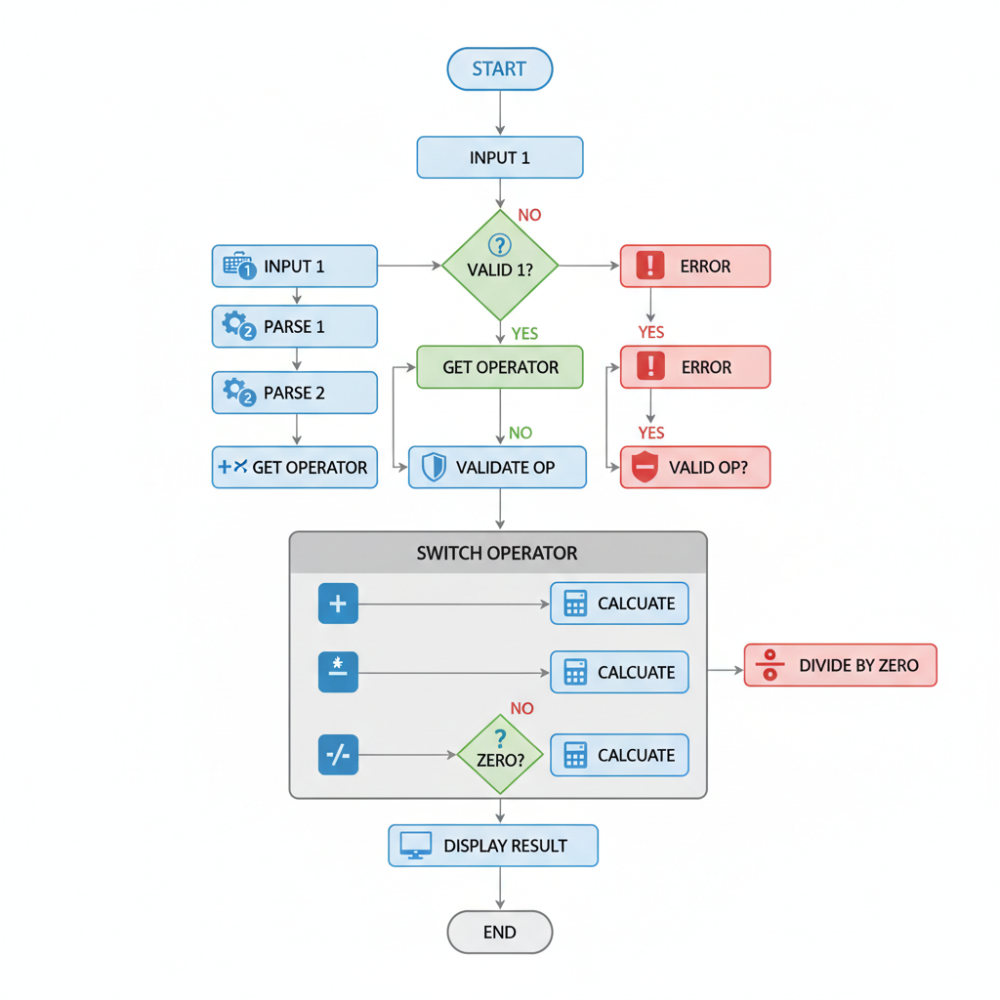

# Introduction to C# Data Types, Variables, and Operators

Welcome to the foundational module of our Full Stack .NET Development journey! In this lesson, we will dive deep into the core building blocks of C# programming: data types, variables, and operators. Understanding these fundamental concepts is paramount for any aspiring developer, as they form the bedrock upon which all complex applications are built. This lesson is designed to equip you with the knowledge to effectively store, manipulate, and process data within your C# applications.

Module Learning Objectives Addressed:

    Master fundamental C# data types and control structures.
    Understand object-oriented programming principles in C#.
    Work with collections and arrays.
    Implement error handling using exceptions.

Real-World Relevance: Every piece of software, from a simple calculator to a sophisticated enterprise system, deals with data. Whether it's user input, database records, financial transactions, or system configurations, data is at the heart of it all. The way you define, store, and operate on this data directly impacts your application's performance, accuracy, and maintainability. For instance, choosing the correct data type for a financial value can prevent subtle but critical errors. Understanding operators allows you to perform calculations and make logical decisions, which are essential for any dynamic application. This lesson will provide you with the essential toolkit to handle data effectively in C#.

By the end of this lesson, you will be able to:

    Identify and utilize various primitive C# data types.
    Differentiate between value types and reference types.
    Declare, initialize, and manage variables effectively.
    Apply arithmetic, relational, and logical operators to perform computations and comparisons.
    Understand and implement type casting and conversion.
    Perform basic string manipulation operations.

We will be using Visual Studio 2022 as our primary Integrated Development Environment (IDE) and the latest stable version of the .NET SDK. Let's begin by exploring the diverse world of C# data types.

## Understanding Primitive Data Types in C#

In C#, data types define the kind of values a variable can hold and the operations that can be performed on it. Primitive data types, also known as built-in types, are the most fundamental types provided by the language. They represent simple values and are the building blocks for more complex data structures. Understanding these types is crucial for efficient memory management and accurate data representation.
1. Integer Types (Numeric)

Integer types are used to store whole numbers (numbers without a fractional component). C# provides several integer types, differing in the range of values they can hold and the amount of memory they consume. The choice of integer type depends on the expected range of your numerical data.

    sbyte: An 8-bit signed integer. Range: -128 to 127. Useful for very small integer values.
    byte: An 8-bit unsigned integer. Range: 0 to 255. Ideal for representing raw byte data or small positive numbers.
    short: A 16-bit signed integer. Range: -32,768 to 32,767.
    ushort: A 16-bit unsigned integer. Range: 0 to 65,535.
    int: A 32-bit signed integer. This is the most commonly used integer type. Range: approximately -2.1 billion to 2.1 billion.
    uint: A 32-bit unsigned integer. Range: 0 to approximately 4.2 billion.
    long: A 64-bit signed integer. Used for very large integer values. Range: approximately -9.2 quintillion to 9.2 quintillion.
    ulong: A 64-bit unsigned integer. Range: 0 to approximately 18.4 quintillion.

Example Usage:

int age = 30;
byte numberOfItems = 150;
long population = 7800000000L; // 'L' suffix denotes a long literal

2. Floating-Point Types (Numeric)

Floating-point types are used to store numbers that may have a fractional component. They are essential for calculations involving decimals, such as scientific computations or financial figures where precision is key.

    float: A single-precision 32-bit floating-point number. It has a wide range but limited precision (about 7 decimal digits). Use the 'F' or 'f' suffix for float literals.
    double: A double-precision 64-bit floating-point number. This is the default type for floating-point literals in C# and offers a wider range and better precision (about 15-17 decimal digits) than float.
    decimal: A 128-bit data type specifically designed for financial and monetary calculations. It offers very high precision (28-29 decimal digits) but has a smaller range compared to double. Use the 'M' or 'm' suffix for decimal literals. It is crucial for avoiding rounding errors in financial applications.

Example Usage:

double price = 19.99;
float piApproximation = 3.14159F;
decimal accountBalance = 12345.6789M;

3. Boolean Type (Logical)

The bool type represents logical values. It can only hold one of two possible values: true or false. Booleans are fundamental for controlling program flow through conditional statements and loops.

Example Usage:

bool isComplete = true;
bool hasError = false;

if (isComplete)
{
    Console.WriteLine("Operation successful.");
}

4. Character Type (Text)

The char type is used to store a single character. Characters are enclosed in single quotation marks. C# uses the Unicode standard, meaning char can represent a wide range of characters from different languages and symbols.

Example Usage:

char grade = 'A';
char currencySymbol = '$';
char newLine = '\n'; // Represents a newline character

5. String Type (Text)

The string type is used to store a sequence of characters, essentially text. Unlike char, strings are enclosed in double quotation marks. In C#, strings are reference types, which have important implications for how they are handled in memory. They are immutable, meaning once a string object is created, its content cannot be changed. Any operation that appears to modify a string actually creates a new string object.

Example Usage:

string userName = "Alice";
string message = "Welcome to C# programming!";
string path = @"C:\\Users\\Documents"; // Verbatim string literal to avoid escaping backslashes

Understanding these primitive data types is the first step towards writing effective C# code. Each type has specific characteristics that make it suitable for different kinds of data and operations. Choosing the right type ensures your program is efficient, accurate, and robust.

## Value Types vs. Reference Types in C#

A fundamental concept in C# that significantly impacts how data is stored and managed is the distinction between value types and reference types. This distinction affects variable assignment, parameter passing, and memory management.
1. Value Types

Variables of value types directly contain their data. When you assign a value type variable to another, the value is copied. This means each variable has its own independent copy of the data.

    Memory Allocation: Value types are typically stored on the stack. The stack is a region of memory that is managed automatically and efficiently. When a variable goes out of scope, its memory on the stack is automatically reclaimed.
    Data Storage: The variable itself holds the actual data.
    Assignment Behavior: Assignment creates a complete copy of the value.
    Common Examples: All primitive numeric types (int, float, double, decimal, byte, etc.), the bool type, and the char type are value types. User-defined types using the struct keyword are also value types.

Illustrative Example:

int a = 10;
int b = a; // 'b' gets a copy of 'a's value
b = 20;    // Changing 'b' does not affect 'a'

Console.WriteLine($"a: {a}"); // Output: a: 10
Console.WriteLine($"b: {b}"); // Output: b: 20

In this example, when b = a; is executed, the value 10 is copied from a to b. Modifying b later does not alter the value stored in a because they are independent copies.
2. Reference Types

Variables of reference types do not directly contain their data. Instead, they store a reference (or pointer) to the location in memory where the actual data is stored. This data resides on the heap.

    Memory Allocation: The actual data for reference types is stored on the heap, a larger, more flexible memory area managed by the .NET Garbage Collector. The variable itself holds a memory address (a reference) pointing to this data on the heap.
    Data Storage: The variable holds a reference (memory address) to the data.
    Assignment Behavior: Assignment copies the reference, not the data. Both variables will then point to the same object on the heap.
    Common Examples: Classes (including string, although it has some unique immutable characteristics), arrays, delegates, and interfaces are reference types.

Illustrative Example:

// Assuming 'MyClass' is a class definition
MyClass objA = new MyClass();
objA.Value = 10;

MyClass objB = objA; // 'objB' now holds a reference to the SAME object as 'objA'
objB.Value = 20;    // Changing the object through 'objB' also affects 'objA'

Console.WriteLine($"objA.Value: {objA.Value}"); // Output: objA.Value: 20
Console.WriteLine($"objB.Value: {objB.Value}"); // Output: objB.Value: 20

In this scenario, objB = objA; copies the memory address of the object created by new MyClass(). Both objA and objB point to the same object on the heap. Therefore, modifying the object's Value property through objB also changes it for objA.
Why This Distinction Matters

Understanding this difference is critical for several reasons:

    Data Integrity: When you pass a value type to a method, a copy is passed (pass-by-value), so the original variable is unaffected. When you pass a reference type, a copy of the reference is passed (also pass-by-value for the reference itself), but since both the original and the copied reference point to the same object, modifications made within the method *will* affect the original object.
    Performance: Stack allocation for value types is generally faster than heap allocation for reference types due to its simpler management.
    Memory Management: The Garbage Collector automatically reclaims memory for objects on the heap when they are no longer referenced. Stack memory for value types is reclaimed automatically when they go out of scope.
    Equality Comparisons: Comparing two value type variables checks if their values are equal. Comparing two reference type variables checks if they refer to the exact same object in memory (unless overridden).

This foundational knowledge of value vs. reference types will be invaluable as you progress to more complex C# concepts like object-oriented programming and data structures.

## Declaring and Initializing Variables in C#

Variables are named storage locations in memory that hold data. In C#, you must declare a variable before you can use it. Declaration involves specifying the variable's data type and its name. Initialization is the process of assigning an initial value to the variable.
1. Variable Declaration

The syntax for declaring a variable is:

dataType variableName;

For example:

int score;
double temperature;
string userName;
bool isActive;

When you declare a variable without initializing it, its value is set to the default value for its type:

    Numeric types (int, float, etc.): 0
    bool: false
    char: '\0' (the null character)
    Reference types (classes, arrays, etc.): null

Attempting to use a variable before it has been assigned a value (unless it's a reference type initialized to null) will result in a compile-time error.
2. Variable Initialization

Initialization assigns a starting value to a variable. You can initialize a variable at the time of declaration or later.
a) Initialization at Declaration

This is the most common and recommended approach for value types to ensure they always have a valid starting value.

int score = 0;
double temperature = 98.6;
string userName = "Guest";
bool isActive = false;
char initial = 'J';

b) Initialization After Declaration

You can declare a variable first and then assign a value to it later using the assignment operator (=).

int quantity;
quantity = 100; // Initialization after declaration

string message;
message = "Processing...";

3. Variable Naming Conventions

C# follows specific naming conventions to enhance code readability and maintainability:

    PascalCase: Used for variable names, method names, class names, and other identifiers. The first letter of each word in the identifier is capitalized. Example: totalSales, CalculateTotal, CustomerAccount.
    camelCase: Sometimes used for local variables within methods, especially in older codebases or by convention in specific teams, but PascalCase is generally preferred for consistency in modern C# development.
    Meaningful Names: Choose names that clearly describe the purpose of the variable. Avoid single-letter names (except for loop counters like i, j) or cryptic abbreviations.
    Avoid Reserved Keywords: Do not use C# reserved keywords (like int, class, if, for) as variable names.

Example of Good Naming:

int numberOfStudents = 45;
double averageScore = 85.5;
string studentName = "Alice Smith";
bool isEnrolled = true;

4. Using the var Keyword (Implicitly Typed Local Variables)

C# 3.0 introduced the var keyword, which allows the compiler to infer the data type of a variable based on the value assigned to it during initialization. This is particularly useful for complex type names or when the type is obvious from the initialization.

Important Notes about var:

    var can only be used for local variables declared inside a method or code block.
    The variable must be initialized at the time of declaration.
    The compiler determines the type at compile time; it does not make the variable dynamically typed.

Example Usage:

var count = 10;             // Compiler infers 'count' is of type 'int'
var pi = 3.14159;         // Compiler infers 'pi' is of type 'double'
var message = "Hello";    // Compiler infers 'message' is of type 'string'
var today = DateTime.Now; // Compiler infers 'today' is of type 'DateTime'

// The following would cause a compile-time error because 'var' requires initialization:
// var data;

// The following would cause a compile-time error because you cannot change the inferred type:
// var number = 5;
// number = "six"; // Error: Cannot implicitly convert type 'string' to 'int'

Using var can make your code more concise, but always ensure readability is maintained. If the type is not immediately obvious from the initialization, it's often better to explicitly state the type.
Hands-on Component: Declaring and Initializing Variables

Let's practice declaring and initializing variables in Visual Studio.

    Open Visual Studio 2022.
    Create a new Console Application project (File -> New -> Project -> Console App).
    In the Program.cs file, replace the existing code with the following:

using System;

public class VariableDemo
{
    public static void Main(string[] args)
    {
        // --- Primitive Data Type Declarations and Initializations ---

        // Integer types
        int numberOfStudents = 35;
        long worldPopulation = 8000000000L;
        byte maxBytes = 255;

        // Floating-point types
        double averageScore = 78.5;
        decimal productPrice = 49.99M;
        float temperatureCelsius = 25.5F;

        // Boolean type
        bool isUserLoggedIn = true;

        // Character type
        char firstInitial = 'J';

        // String type
        string userName = "Jane Doe";
        string welcomeMessage = "Hello, " + userName + "!";

        // Using 'var' keyword
        var itemCount = 10;
        var discountRate = 0.15;
        var isActiveStatus = false;

        // --- Outputting variable values ---
        Console.WriteLine("--- Variable Values ---");
        Console.WriteLine($"Number of Students: {numberOfStudents}");
        Console.WriteLine($"World Population: {worldPopulation}");
        Console.WriteLine($"Max Bytes: {maxBytes}");
        Console.WriteLine($"Average Score: {averageScore}");
        Console.WriteLine($"Product Price: {productPrice}");
        Console.WriteLine($"Temperature: {temperatureCelsius}°C");
        Console.WriteLine($"Is User Logged In: {isUserLoggedIn}");
        Console.WriteLine($"First Initial: {firstInitial}");
        Console.WriteLine($"Welcome Message: {welcomeMessage}");
        Console.WriteLine($"Item Count (var): {itemCount}");
        Console.WriteLine($"Discount Rate (var): {discountRate}");
        Console.WriteLine($"Is Active Status (var): {isActiveStatus}");

        // --- Demonstrating Value vs. Reference Type Assignment ---
        Console.WriteLine("\n--- Value vs. Reference Type Assignment ---");

        // Value Type Example
        int valA = 100;
        int valB = valA;
        valB = 200;
        Console.WriteLine($"Value Type: valA = {valA}, valB = {valB}"); // Expected: valA = 100, valB = 200

        // Reference Type Example (using string, which is immutable but demonstrates reference behavior)
        string refA = "Initial";
        string refB = refA;
        refB = "Modified";
        Console.WriteLine($"Reference Type (String): refA = {refA}, refB = {refB}"); // Expected: refA = Initial, refB = Modified
        // Note: For strings, assignment copies the reference, but modification creates a new string.
        // For mutable reference types (like custom classes), changing refB would change refA's object.

        Console.ReadKey(); // Keep the console window open
    }
}

    Run the application (press F5 or click the Start button). Observe the output in the console window.

This exercise reinforces the concepts of declaring variables with specific data types, initializing them with appropriate values, and understanding the behavior of value and reference types during assignment.

## Mastering Operators: Arithmetic, Relational, and Logical

Operators are special symbols that perform operations on one or more operands (values or variables). C# provides a rich set of operators to manipulate data, perform calculations, and make decisions within your programs. We will explore the most common categories: arithmetic, relational, and logical operators.
1. Arithmetic Operators

These operators are used to perform mathematical calculations.

    + (Addition): Adds two operands. Can also be used for string concatenation.
    - (Subtraction): Subtracts the right operand from the left operand.
    * (Multiplication): Multiplies two operands.
    / (Division): Divides the left operand by the right operand. If both operands are integers, the result is an integer (truncating any fractional part). If at least one operand is a floating-point type, the result is a floating-point number.
    % (Modulo): Returns the remainder of an integer division. Useful for checking even/odd numbers or distributing items into groups.

Example Usage:

int a = 10;
int b = 3;
double c = 10.0;

int sum = a + b;         // sum = 13
int difference = a - b;  // difference = 7
int product = a * b;     // product = 30
int quotientInt = a / b; // quotientInt = 3 (integer division)
double quotientDouble = c / b; // quotientDouble = 3.333...
int remainder = a % b;   // remainder = 1 (10 divided by 3 is 3 with a remainder of 1)

string firstName = "John";
string lastName = "Doe";
string fullName = firstName + " " + lastName; // fullName = "John Doe"

2. Relational Operators (Comparison Operators)

These operators are used to compare two values. They return a bool value (true or false), which is essential for conditional logic.

    == (Equal to): Checks if two operands are equal.
    != (Not equal to): Checks if two operands are not equal.
    > (Greater than): Checks if the left operand is greater than the right operand.
    < (Less than): Checks if the left operand is less than the right operand.
    >= (Greater than or equal to): Checks if the left operand is greater than or equal to the right operand.
    <= (Less than or equal to): Checks if the left operand is less than or equal to the right operand.

Example Usage:

int x = 15;
int y = 20;

bool isEqual = (x == y);       // isEqual = false
bool isNotEqual = (x != y);     // isNotEqual = true
bool isXGreater = (x > y);     // isXGreater = false
bool isYGreaterOrEqual = (y >= x); // isYGreaterOrEqual = true

// Comparing strings (case-sensitive by default)
string str1 = "hello";
string str2 = "Hello";
bool areStringsEqual = (str1 == str2); // areStringsEqual = false

3. Logical Operators

These operators are used to combine or modify boolean expressions. They are crucial for creating complex conditions.

    && (Logical AND): Returns true if both operands are true. It uses short-circuiting: if the left operand is false, the right operand is not evaluated.
    || (Logical OR): Returns true if at least one of the operands is true. It uses short-circuiting: if the left operand is true, the right operand is not evaluated.
    ! (Logical NOT): Reverses the boolean value of its operand. If the operand is true, it returns false, and vice versa.
    ^ (Logical XOR - Exclusive OR): Returns true if exactly one of the operands is true.
    & (Bitwise AND): Can be used with boolean operands. Unlike &&, it always evaluates both operands.
    | (Bitwise OR): Can be used with boolean operands. Unlike ||, it always evaluates both operands.

Example Usage:

int age = 25;
bool isStudent = true;

// Using && (AND)
bool canVote = (age >= 18) && isStudent; // true (both conditions are true)

// Using || (OR)
bool hasDiscount = (age < 18) || isStudent; // true (isStudent is true)

// Using ! (NOT)
bool isAdult = ! (age < 18); // true (age is not less than 18)

// Short-circuiting example:
int divisor = 0;
// bool result = (divisor != 0) && (10 / divisor > 5); // This would cause a DivideByZeroException if divisor was 0
// With short-circuiting &&, if (divisor != 0) is false, the second part is skipped.

bool isEligible = (age >= 18) && isStudent;
Console.WriteLine($"Is eligible: {isEligible}"); // Output: Is eligible: True

4. Assignment Operators

These operators assign a value to a variable. The most basic is the assignment operator (=).

C# also provides compound assignment operators that combine an arithmetic operation with an assignment:

    += (Add and assign): x += y is equivalent to x = x + y
    -= (Subtract and assign): x -= y is equivalent to x = x - y
    *= (Multiply and assign): x *= y is equivalent to x = x * y
    /= (Divide and assign): x /= y is equivalent to x = x / y
    %= (Modulo and assign): x %= y is equivalent to x = x % y

Example Usage:

int counter = 0;
counter += 1; // counter is now 1
counter *= 5; // counter is now 5

string greeting = "Hi";
greeting += ", there!"; // greeting is now "Hi, there!"

Hands-on Component: Performing Operations with Operators

Let's implement a C# program to demonstrate the usage of various operators.

    Open your existing Console Application project in Visual Studio or create a new one.
    Replace the code in Program.cs with the following:

using System;

public class OperatorDemo
{
    public static void Main(string[] args)
    {
        Console.WriteLine("--- Arithmetic Operators ---");
        int num1 = 25;
        int num2 = 7;
        double num3 = 25.0;

        Console.WriteLine($"{num1} + {num2} = {num1 + num2}");
        Console.WriteLine($"{num1} - {num2} = {num1 - num2}");
        Console.WriteLine($"{num1} * {num2} = {num1 * num2}");
        Console.WriteLine($"{num1} / {num2} = {num1 / num2} (Integer Division)");
        Console.WriteLine($"{num3} / {num2} = {num3 / num2} (Double Division)");
        Console.WriteLine($"{num1} % {num2} = {num1 % num2} (Remainder)");

        string firstName = "Alice";
        string lastName = "Smith";
        Console.WriteLine($"Concatenated Name: {firstName + " " + lastName}");

        Console.WriteLine("\n--- Relational Operators ---");
        int age = 30;
        int retirementAge = 65;
        bool isAdult = age >= 18;
        bool isSenior = age >= retirementAge;

        Console.WriteLine($"Is {age} adult? {isAdult}");
        Console.WriteLine($"Is {age} senior? {isSenior}");
        Console.WriteLine($"Is {age} equal to 30? {age == 30}");
        Console.WriteLine($"Is {age} not equal to 30? {age != 30}");

        Console.WriteLine("\n--- Logical Operators ---");
        bool hasLicense = true;
        bool hasCar = false;

        bool canDrive = isAdult && hasLicense;
        Console.WriteLine($"Can drive (Adult AND Has License)? {canDrive}");

        bool canGoOut = isAdult || hasCar;
        Console.WriteLine($"Can go out (Adult OR Has Car)? {canGoOut}");

        bool isNotSenior = !isSenior;
        Console.WriteLine($"Is NOT senior? {isNotSenior}");

        Console.WriteLine("\n--- Compound Assignment Operators ---");
        int score = 50;
        Console.WriteLine($"Initial score: {score}");
        score += 20; // score = score + 20
        Console.WriteLine($"After += 20: {score}");
        score *= 2;  // score = score * 2
        Console.WriteLine($"After *= 2: {score}");
        score -= 10; // score = score - 10
        Console.WriteLine($"After -= 10: {score}");

        Console.ReadKey();
    }
}

    Run the application and observe the output, paying close attention to the results of each operation.

This practical exercise will solidify your understanding of how operators work and how they are used to manipulate data and control program logic.

## Type Casting and Conversion in C#

Type casting and conversion are essential processes in C# that allow you to change the data type of a value. This is often necessary when you need to perform operations between different types or when assigning values from one type to another. There are two main types of conversions: implicit and explicit.
1. Implicit Conversion

Implicit conversion occurs automatically when the compiler can determine that the conversion is safe and will not result in data loss. This typically happens when converting from a smaller data type to a larger one within the same category (e.g., from int to long, or from float to double).

Characteristics:

    No data loss is expected.
    No explicit casting syntax is required.
    The compiler handles it automatically.

Examples:

int myInt = 100;
long myLong = myInt; // Implicit conversion from int to long

double myDouble = 5.75;
float myFloat = (float)myDouble; // Explicit cast needed here because float has less precision

// Example of safe implicit conversion:
int smallNumber = 50;
long largeNumber = smallNumber; // Safe: int fits within long

double preciseNumber = 123.456;
float approximateNumber = (float)preciseNumber; // Explicit cast needed due to potential precision loss

// Implicit conversion between numeric types:
byte b = 10;
int i = b;      // byte to int
long l = i;     // int to long
float f = l;    // long to float
double d = f;   // float to double

// String concatenation also involves implicit conversion for display purposes
int quantity = 5;
string message = "Items: " + quantity; // quantity (int) is implicitly converted to string

2. Explicit Conversion (Casting)

Explicit conversion, also known as casting, is required when the conversion might result in data loss or a change in value. This typically occurs when converting from a larger data type to a smaller one (e.g., from long to int) or between unrelated types.

You must use casting syntax to tell the compiler that you are aware of the potential risks and intend to perform the conversion.

Syntax:

targetType variableName = (targetType)sourceExpression;

Examples:

long bigNumber = 10000000000L;
int smallNumber = (int)bigNumber; // Explicit cast: Potential data loss if bigNumber exceeds int.MaxValue

double pi = 3.14159;
int integerPart = (int)pi; // integerPart will be 3 (fractional part is truncated)

// Example of potential data loss:
int largeIntValue = 200;
byte smallByteValue = (byte)largeIntValue; // smallByteValue will be 200 (if within byte range) or wrap around if it exceeds 255.
                                         // If largeIntValue was 300, smallByteValue would be 44 (300 % 256).

// Casting to a char:
int asciiValue = 65;
char character = (char)asciiValue; // character will be 'A'

3. Using the Convert Class

The System.Convert class provides a set of static methods for performing conversions between various data types. These methods are often more robust and handle edge cases better than simple casting, especially when converting strings to numeric types.

Common Convert Methods:

    Convert.ToInt32(value): Converts a value to a 32-bit signed integer.
    Convert.ToDouble(value): Converts a value to a double-precision floating-point number.
    Convert.ToString(value): Converts a value to its string representation.
    Convert.ToBoolean(value): Converts a value to a boolean.
    Convert.ToDecimal(value): Converts a value to a decimal.

Examples:

string numberString = "123";

// Converting string to int using Convert
int numberFromString = Convert.ToInt32(numberString);

// Converting string to double
double doubleFromString = Convert.ToDouble("45.67");

// Converting boolean to string
bool status = true;
string statusString = Convert.ToString(status); // statusString will be "True"

// Converting numeric to decimal
int intValue = 100;
decimal decimalValue = Convert.ToDecimal(intValue); // decimalValue will be 100.0M

// Converting from float to decimal
float floatValue = 99.9f;
decimal decimalFromFloat = Convert.ToDecimal(floatValue); // Handles potential precision issues better than direct cast

4. Parsing Strings

Parsing is the process of converting a string representation of a value into its actual data type. This is commonly done with numeric types and dates.

The most common methods for parsing are:

    Type.Parse(string): Attempts to parse the string and returns the converted value. Throws an exception if the conversion fails.
    Type.TryParse(string, out Type result): Attempts to parse the string and returns a boolean indicating success or failure. The converted value is stored in the out parameter. This method is safer as it avoids exceptions.

Examples:

string intStr = "42";

// Using Parse (can throw FormatException)
try
{
    int parsedInt = int.Parse(intStr);
    Console.WriteLine($"Parsed integer: {parsedInt}");
}
catch (FormatException)
{
    Console.WriteLine("Invalid format for integer.");
}

// Using TryParse (safer)
string doubleStr = "3.14159";
double parsedDouble;

if (double.TryParse(doubleStr, out parsedDouble))
{
    Console.WriteLine($"Successfully parsed double: {parsedDouble}");
}
else
{
    Console.WriteLine("Failed to parse double.");
}

string invalidStr = "abc";
int tryParseResult;
if (int.TryParse(invalidStr, out tryParseResult))
{
    Console.WriteLine($"Parsed integer: {tryParseResult}");
}
else
{
    Console.WriteLine($"Failed to parse '{invalidStr}' as an integer."); // This will be printed
}

When to Use Which Method

    Implicit Conversion: Use whenever possible for safety and simplicity.
    Explicit Casting: Use when you are certain about the conversion and understand the risks of data loss. Always consider using try-catch blocks or TryParse for potentially unsafe conversions.
    Convert Class: Excellent for converting between various types, especially when dealing with strings that represent numbers or booleans. It provides a consistent interface.
    Parse/TryParse: The standard and safest way to convert strings to numeric types or dates, with TryParse being preferred for its exception-free operation.

Mastering type conversions is crucial for handling data accurately and preventing runtime errors in your C# applications.

## Introduction to String Manipulation in C#

Strings are fundamental for handling text data in applications, from user input to displaying messages. C# provides a rich set of tools and methods for manipulating strings, allowing you to combine, modify, search, and format text effectively. Remember that strings in C# are immutable reference types, meaning any operation that appears to modify a string actually creates a new string object.
1. String Concatenation

Concatenation is the process of joining two or more strings together.

    Using the + operator: The simplest way to concatenate strings.
    Using the += operator: Appends a string to an existing string variable.
    Using string.Concat(): A static method that concatenates strings.
    Using string.Join(): Joins elements of a collection (like an array or list) into a single string, using a specified separator.

Examples:

string part1 = "Hello";
string part2 = "World";

// Using + operator
string greeting = part1 + " " + part2 + "!"; // greeting = "Hello World!"

// Using += operator
string message = "Learning";
message += " C#"; // message = "Learning C#"

// Using string.Concat()
string combined = string.Concat(part1, " ", part2);

// Using string.Join()
string[] words = {"This", "is", "an", "array"};
string sentence = string.Join(" ", words); // sentence = "This is an array"

string csvData = "Apple,Banana,Cherry";
string[] fruits = csvData.Split(','); // Split creates an array
string joinedFruits = string.Join("; ", fruits); // joinedFruits = "Apple; Banana; Cherry"

2. String Formatting

Formatting allows you to create strings with embedded values in a structured way. This is often more readable and efficient than manual concatenation, especially with multiple variables.

    String Interpolation ($ prefix): The most modern and readable way. Embed variables directly within string literals using curly braces {}.
    string.Format(): A powerful method that uses numbered placeholders ({0}, {1}, etc.) to insert values.

Examples:

string productName = "Laptop";
decimal price = 1200.50m;
int quantity = 2;

// Using String Interpolation
string summaryInterpolated = $"Product: {productName}, Price: {price:C}, Quantity: {quantity}";
// The ':C' formats the price as currency. Output: Product: Laptop, Price: $1,200.50, Quantity: 2 (currency symbol may vary by culture)

// Using string.Format()
string summaryFormatted = string.Format("Product: {0}, Price: {1:C}, Quantity: {2}", productName, price, quantity);
// Output is similar to the interpolated string.

// Formatting numbers with specific precision:
double pi = 3.1415926535;
string formattedPi = $"Pi to 2 decimal places: {pi:F2}"; // F2 formats as fixed-point with 2 decimal places
// Output: Pi to 2 decimal places: 3.14

string formattedPiLong = $"Pi with 4 decimal places: {pi:N4}"; // N4 formats with thousands separator and 4 decimal places
// Output: Pi with 4 decimal places: 3,141.5927 (separator may vary)

3. Common String Methods

C# provides numerous built-in methods for string manipulation:

    Length property: Returns the number of characters in a string.
    ToUpper() / ToLower(): Converts a string to uppercase or lowercase.
    Trim() / TrimStart() / TrimEnd(): Removes leading and trailing whitespace (or specified characters).
    Replace(oldValue, newValue): Returns a new string where all occurrences of a specified substring are replaced.
    Substring(startIndex, length): Extracts a substring starting from a specified index.
    IndexOf(substring): Returns the zero-based index of the first occurrence of a substring. Returns -1 if not found.
    Contains(substring): Returns true if the string contains a specified substring, false otherwise.
    Split(separator): Splits a string into an array of substrings based on a delimiter.
    IsNullOrEmpty(string) / IsNullOrWhiteSpace(string): Static methods to check if a string is null, empty, or consists only of whitespace.

Examples:

string sentence = "  C# is powerful!  ";

Console.WriteLine($"Original: '{sentence}'");
Console.WriteLine($"Length: {sentence.Length}"); // Length: 20 (includes spaces)

Console.WriteLine($"Uppercase: {sentence.ToUpper()}"); // Uppercase: '  C# IS POWERFUL!  '
Console.WriteLine($"Trimmed: '{sentence.Trim()}'"); // Trimmed: 'C# is powerful!'

string modified = sentence.Replace("powerful", "versatile");
Console.WriteLine($"Replaced: '{modified}'"); // Replaced: '  C# is versatile!  '

string sub = modified.Substring(3, 2); // Starts at index 3, takes 2 characters
Console.WriteLine($"Substring: '{sub}'"); // Substring: 'is'

int indexOfIs = modified.IndexOf("is");
Console.WriteLine($"Index of 'is': {indexOfIs}"); // Index of 'is': 3

bool hasPower = modified.Contains("power");
Console.WriteLine($"Contains 'power'? {hasPower}"); // Contains 'power'? False

string data = "one,two,three";
string[] parts = data.Split(',');
Console.WriteLine($"Split into {parts.Length} parts."); // Split into 3 parts.

string emptyString = "";
string nullString = null;

Console.WriteLine($"Is emptyString null or empty? {string.IsNullOrEmpty(emptyString)}"); // True
Console.WriteLine($"Is nullString null or empty? {string.IsNullOrEmpty(nullString)}"); // True
Console.WriteLine($"Is '   ' null or whitespace? {string.IsNullOrWhiteSpace("   ")}"); // True

Hands-on Component: String Concatenation and Formatting

Let's create a program that uses string manipulation techniques.

    Open your C# Console Application project.
    Replace the code in Program.cs with the following:

using System;

public class StringManipulationDemo
{
    public static void Main(string[] args)
    {
        // --- String Concatenation Examples ---
        Console.WriteLine("--- String Concatenation ---");
        string firstName = "Bob";
        string lastName = "Johnson";
        string greeting = "Hello, ";

        // Using + operator
        string fullName = greeting + firstName + " " + lastName + "!";
        Console.WriteLine($"Full Name: {fullName}");

        // Using string.Join for a list of items
        string[] items = {"Apples", "Bananas", "Cherries"};
        string itemList = string.Join(", ", items);
        Console.WriteLine($"Item List: {itemList}");

        // --- String Formatting Examples ---
        Console.WriteLine("\n--- String Formatting ---");
        string item = "Widget";
        decimal unitPrice = 15.75m;
        int quantityOrdered = 5;
        DateTime orderDate = DateTime.Now;

        // Using String Interpolation
        string orderSummaryInterpolated = $"Order Summary:\n  Item: {item}\n  Unit Price: {unitPrice:C}\n  Quantity: {quantityOrdered}\n  Total: {unitPrice * quantityOrdered:C}\n  Order Date: {orderDate:yyyy-MM-dd}";
        Console.WriteLine(orderSummaryInterpolated);

        // Using string.Format()
        string orderSummaryFormatted = string.Format(
            "Order Summary:\n  Item: {0}\n  Unit Price: {1:C}\n  Quantity: {2}\n  Total: {3:C}\n  Order Date: {4:yyyy-MM-dd}",
            item, unitPrice, quantityOrdered, unitPrice * quantityOrdered, orderDate);
        Console.WriteLine(orderSummaryFormatted);

        // --- Other String Operations ---
        Console.WriteLine("\n--- Other String Operations ---");
        string sampleText = "  The quick brown fox jumps over the lazy dog.  ";
        Console.WriteLine($"Original Text: '{sampleText}'");

        Console.WriteLine($"Length: {sampleText.Length}");
        Console.WriteLine($"Trimmed Text: '{sampleText.Trim()}'");
        Console.WriteLine($"Uppercase: '{sampleText.Trim().ToUpper()}'");
        Console.WriteLine($"Contains 'fox'? {sampleText.Contains("fox")}");
        Console.WriteLine($"Index of 'jumps': {sampleText.IndexOf("jumps")}");

        string replacedText = sampleText.Replace("lazy", "energetic");
        Console.WriteLine($"Replaced Text: '{replacedText}'");

        string firstPart = sampleText.Substring(3, 5); // Extracts 'quick'
        Console.WriteLine($"Substring (index 3, length 5): '{firstPart}'");

        Console.ReadKey();
    }
}

    Run the application and examine the output to see how different string manipulation techniques work.

Proficiency in string manipulation is essential for building user-friendly applications that can process and present textual information effectively.

## Practical Application: Building a Simple Calculator

 [alt text](<1. C#_data_types_variable_and_operators.md>)
Now, let's consolidate our learning by building a simple command-line calculator. This exercise will involve declaring variables, using arithmetic and relational operators, performing type conversions, and handling user input (which we'll treat as strings initially).
Objective

Create a C# console application that:

    Prompts the user to enter two numbers.
    Prompts the user to enter an operator (+, -, *, /).
    Performs the calculation based on the input.
    Displays the result.
    Handles basic invalid input (e.g., non-numeric input, division by zero).

Step-by-Step Implementation Guide
Step 1: Set up the Project

Create a new C# Console Application project in Visual Studio named SimpleCalculator.
Step 2: Get User Input for Numbers

We need to read input from the user. Console input is always read as a string. We'll use Console.ReadLine() and then parse these strings into numeric types (e.g., double for flexibility).

using System;

public class SimpleCalculator
{
    public static void Main(string[] args)
    {
        Console.WriteLine("--- Simple C# Calculator ---");

        // Get first number
        Console.Write("Enter the first number: ");
        string input1 = Console.ReadLine();
        double num1;

        // Get second number
        Console.Write("Enter the second number: ");
        string input2 = Console.ReadLine();
        double num2;

        // ... rest of the code ...
    }
}

Step 3: Parse Input and Handle Errors

Use double.TryParse() to safely convert the input strings to doubles. If parsing fails, inform the user and exit.

// Inside Main method, after reading inputs:

if (!double.TryParse(input1, out num1))
{
    Console.WriteLine("Invalid input for the first number. Please enter a valid number.");
    Console.ReadKey();
    return; // Exit the application
}

if (!double.TryParse(input2, out num2))
{
    Console.WriteLine("Invalid input for the second number. Please enter a valid number.");
    Console.ReadKey();
    return; // Exit the application
}

Step 4: Get User Input for Operator

Prompt the user for the operator and read it as a string.

// Inside Main method, after parsing numbers:

Console.Write("Enter an operator (+, -, *, /): ");
string operatorInput = Console.ReadLine();
char operation;

// Basic validation for operator input
if (string.IsNullOrEmpty(operatorInput) || operatorInput.Length != 1)
{
    Console.WriteLine("Invalid operator. Please enter one of +, -, *, /.");
    Console.ReadKey();
    return;
}

operation = operatorInput[0]; // Get the first character as the operator

Step 5: Perform Calculation using a Switch Statement

A switch statement is ideal for handling multiple operator choices. We'll also handle division by zero.

// Inside Main method, after getting operator input:

double result = 0;
bool error = false;

switch (operation)
{
    case '+':
        result = num1 + num2;
        break;
    case '-':
        result = num1 - num2;
        break;
    case '*':
        result = num1 * num2;
        break;
    case '/':
        if (num2 == 0)
        {
            Console.WriteLine("Error: Division by zero is not allowed.");
            error = true;
        }
        else
        {
            result = num1 / num2;
        }
        break;
    default:
        Console.WriteLine("Invalid operator entered.");
        error = true;
        break;
}

Step 6: Display the Result

If no error occurred, display the calculated result. Use string formatting for a clean output.

// Inside Main method, after the switch statement:

if (!error)
{
    Console.WriteLine($"\nResult: {num1} {operation} {num2} = {result:F2}"); // Format result to 2 decimal places
}

Console.WriteLine("\nPress any key to exit.");
Console.ReadKey(); // Keep console open

Complete Code for SimpleCalculator

using System;

public class SimpleCalculator
{
    public static void Main(string[] args)
    {
        Console.WriteLine("--- Simple C# Calculator ---");

        // Get first number
        Console.Write("Enter the first number: ");
        string input1 = Console.ReadLine();
        double num1;

        // Get second number
        Console.Write("Enter the second number: ");
        string input2 = Console.ReadLine();
        double num2;

        // Parse first number
        if (!double.TryParse(input1, out num1))
        {
            Console.WriteLine("Invalid input for the first number. Please enter a valid number.");
            Console.ReadKey();
            return;
        }

        // Parse second number
        if (!double.TryParse(input2, out num2))
        {
            Console.WriteLine("Invalid input for the second number. Please enter a valid number.");
            Console.ReadKey();
            return;
        }

        // Get operator
        Console.Write("Enter an operator (+, -, *, /): ");
        string operatorInput = Console.ReadLine();
        char operation;

        if (string.IsNullOrEmpty(operatorInput) || operatorInput.Length != 1)
        {
            Console.WriteLine("Invalid operator. Please enter one of +, -, *, /.");
            Console.ReadKey();
            return;
        }
        operation = operatorInput[0];

        // Perform calculation
        double result = 0;
        bool error = false;

        switch (operation)
        {
            case '+':
                result = num1 + num2;
                break;
            case '-':
                result = num1 - num2;
                break;
            case '*':
                result = num1 * num2;
                break;
            case '/':
                if (num2 == 0)
                {
                    Console.WriteLine("Error: Division by zero is not allowed.");
                    error = true;
                }
                else
                {
                    result = num1 / num2;
                }
                break;
            default:
                Console.WriteLine("Invalid operator entered.");
                error = true;
                break;
        }

        // Display result
        if (!error)
        {
            Console.WriteLine($"\nResult: {num1} {operation} {num2} = {result:F2}");
        }

        Console.WriteLine("\nPress any key to exit.");
        Console.ReadKey();
    }
}

Running the Calculator

    Save the Program.cs file.
    Run the application (F5).
    Test with valid inputs (e.g., 10, 5, +).
    Test with invalid inputs (e.g., entering text for numbers, entering 'x' as an operator, dividing by zero).

This practical exercise demonstrates how to combine data types, variables, operators, type conversions, and basic input/output handling to create a functional application.

## Lesson Summary and Next Steps

In this comprehensive lesson, we have laid a critical foundation for your C# programming journey by exploring data types, variables, and operators. We covered:

    Primitive Data Types: Understanding the fundamental types like int, double, bool, char, and string and their respective uses.
    Value vs. Reference Types: Differentiating how these types are stored in memory (stack vs. heap) and how assignment affects them, which is crucial for managing data and performance.
    Variables: Learning to declare, initialize, and name variables effectively, including the use of the var keyword for type inference.
    Operators: Mastering arithmetic, relational, and logical operators to perform calculations, comparisons, and build complex conditions.
    Type Casting and Conversion: Understanding implicit and explicit conversions, using the Convert class, and safely parsing strings with TryParse.
    String Manipulation: Exploring concatenation, formatting, and essential string methods for working with text data.

We reinforced these concepts through practical code examples and a hands-on calculator application, demonstrating how these building blocks work together.
Best Practices and Pro Tips

    Choose the Right Data Type: Always select the data type that best fits your data's range and precision requirements to optimize memory usage and prevent errors (e.g., use decimal for financial calculations).
    Initialize Variables: Always initialize your variables before use to avoid unexpected behavior and compile-time errors. Use var judiciously for readability.
    Use Meaningful Names: Descriptive variable names significantly improve code clarity and maintainability.
    Prefer TryParse: When converting strings to numbers or other types, use TryParse over Parse to handle potential errors gracefully without crashing your application.
    Understand Immutability: Remember that strings are immutable. Operations that seem to modify strings actually create new ones. For performance-critical scenarios involving many string modifications, consider using StringBuilder (which we'll cover later).
    Operator Precedence: Be aware of operator precedence rules (e.g., multiplication before addition) or use parentheses () to explicitly define the order of operations for clarity.

Preparation for the Next Lesson: Control Flow and Iteration

The concepts we've learned about data and operators are essential for making decisions and repeating actions in your programs. In the next lesson, Control Flow and Iteration, we will build upon this knowledge:

    Conditional Statements: You will learn how to use if, else if, else, and switch statements to execute different blocks of code based on conditions.
    Looping Constructs: We will explore for, while, do-while, and foreach loops to repeat tasks efficiently.
    break and continue: Understand how to control the flow within loops.
    Nested Structures: Learn how to combine conditional statements and loops for more complex logic.

To prepare, think about scenarios where you might need to make decisions (e.g., checking if a user is logged in) or repeat actions (e.g., processing each item in a list). This will help you connect the upcoming concepts to practical programming challenges.
Additional Resources

    Microsoft Docs - Value types and reference types in C#: https://docs.microsoft.com/en-us/dotnet/csharp/language-reference/builtin-types/value-types

    Microsoft Docs - Operators in C#: https://docs.microsoft.com/en-us/dotnet/csharp/language-reference/operators/

    Microsoft Docs - String manipulation in C#: https://docs.microsoft.com/en-us/dotnet/csharp/how-to/string-manipulation

Keep practicing these fundamental concepts, as they are the building blocks for all advanced programming tasks.