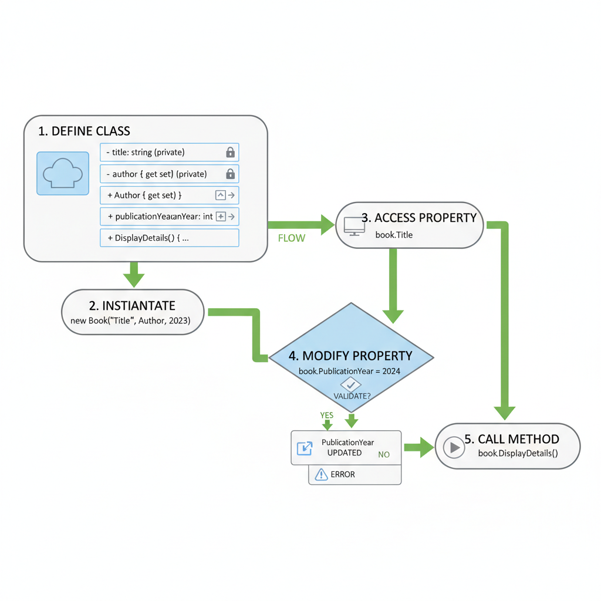

# Introduction to Object-Oriented Programming: The Foundation of Modern Software

Welcome to the fundamental concepts of Object-Oriented Programming (OOP) in C#. In this lesson, we will embark on a journey to understand how OOP principles shape the way we design and build robust, scalable, and maintainable software applications. As aspiring B-Tech graduates entering the field of Full Stack .NET Development, grasping OOP is not just beneficial; it's essential. This module directly supports the learning objective to Understand object-oriented programming principles in C#, while also laying the groundwork for mastering data types, control structures, collections, and error handling, as outlined in the module's broader objectives. We will explore how OOP allows us to model real-world entities within our code, making complex systems more manageable and intuitive. From building sophisticated enterprise applications to developing interactive web services, OOP is the paradigm that powers much of the software you interact with daily. By the end of this lesson, you will be equipped with the knowledge to define classes, create objects, and understand the core tenets that make OOP a cornerstone of modern software development. We will connect these theoretical concepts to practical applications using C# and Visual Studio, ensuring you can immediately apply what you learn.

## The Essence of OOP: Classes and Objects - Blueprints and Instances

At the heart of Object-Oriented Programming lie two fundamental concepts: Classes and Objects. Think of a class as a blueprint or a template for creating something. It defines the properties (data) and behaviors (methods) that all instances of that type will possess. For example, consider a blueprint for a car. This blueprint would specify that a car has properties like color, make, model, and year, and methods like starting the engine, accelerating, and braking. It doesn't represent a specific car, but rather the general concept of a car.

An Object, on the other hand, is an actual instance created from that blueprint. If the class is the blueprint for a car, then a specific red 2023 Toyota Camry is an object. It has concrete values for its properties (color is red, make is Toyota, model is Camry, year is 2023) and can perform the defined methods (you can start its engine, accelerate it, etc.). Every object created from the same class shares the same structure and behaviors, but each object has its own unique state (its specific property values).

In C#, we define classes using the class keyword. For instance, we can define a Car class:

    public class Car
    {
        // Properties and methods will go here
    }

To create an object (an instance) of this class, we use the new keyword, followed by the class name and parentheses. This process is called instantiation. For example, to create an object of our Car class:

    Car myCar = new Car();

Here, myCar is an object (an instance) of the Car class. It's a specific car that we can now interact with. The ability to create multiple, distinct objects from a single class definition is a core power of OOP. Each object maintains its own independent set of data. If we were to create another car object, say anotherCar = new Car();, it would be a separate entity from myCar, even though both were created from the same Car blueprint.

The relationship between classes and objects is fundamental to understanding how OOP allows us to model complex systems. By defining abstract blueprints (classes), we can then create concrete, individual entities (objects) that represent real-world or conceptual items. This abstraction and instantiation process is crucial for organizing code, promoting reusability, and managing complexity in software development. This concept is widely applied in various domains, from game development (e.g., creating multiple enemy objects from an Enemy class) to data management (e.g., creating Customer objects from a Customer class).

Why are Classes and Objects Important?

    Modularity: Classes encapsulate related data and behavior, making code more organized and easier to understand.
    Reusability: Once a class is defined, you can create as many objects as needed from it, avoiding redundant code.
    Abstraction: Classes allow us to focus on the essential features of an entity while hiding unnecessary implementation details.
    Real-world Modeling: OOP enables us to represent real-world entities and their interactions within our software, leading to more intuitive designs.

In Visual Studio, you would typically define your classes in separate .cs files within your project. For example, a Car.cs file would contain the definition of the Car class. When you run your application, you would instantiate these classes in your main program file (e.g., Program.cs) to create and manipulate objects.

## Defining Behavior and State: Properties and Methods in C#

Classes are not just containers for data; they also define the actions that can be performed on that data. These actions are represented by Methods, and the data itself is typically managed through Properties. Together, properties and methods form the core of a class's functionality.

Properties in C# are special members that provide a flexible mechanism to read, write, or compute the value of a private field. They act as controlled access points to the internal data of an object. While you could use public fields directly, properties offer more control and are considered a best practice in C# development. A property typically consists of a get accessor (to retrieve the value) and a set accessor (to assign a value).

Let's enhance our Car class by adding properties for its color and model:

    public class Car
    {
        // Private backing field for the Color property
        private string color;

        // Public property for Color
        public string Color
        {
            get { return color; } // Returns the value of the private field
            set { color = value; } // Assigns the incoming value to the private field
        }

        // Private backing field for the Model property
        private string model;

        // Public property for Model
        public string Model
        {
            get { return model; } 
            set { model = value; } 
        }

        // Methods will be added here later
    }

In this example, color and model are private fields. They are declared as private to restrict direct access from outside the class, promoting encapsulation. The Color and Model are public properties. The get accessor allows us to read the value of the private field, and the set accessor allows us to assign a value to it. The keyword value within the set accessor represents the value being assigned to the property.

C# also offers a shorthand syntax for properties called auto-implemented properties, which is commonly used when no additional logic is needed in the get or set accessors:

    public class Car
    {
        public string Color { get; set; }
        public string Model { get; set; }
    }

This auto-implemented property syntax is cleaner and more concise. The compiler automatically generates the private backing field behind the scenes.

Methods, on the other hand, define the actions or behaviors of an object. They are essentially functions defined within a class. Methods can perform operations, manipulate the object's properties, and interact with other objects.

Let's add methods to our Car class to simulate starting the engine and accelerating:

    using System;

    public class Car
    {
        public string Color { get; set; }
        public string Model { get; set; }

        // Method to start the car's engine
        public void StartEngine()
        {
            Console.WriteLine($"The {Color} {Model}'s engine is starting.");
        }

        // Method to accelerate the car
        public void Accelerate(int speedIncrease)
        {
            Console.WriteLine($"Accelerating. Speed increased by {speedIncrease} km/h.");
        }
    }

In this updated class:

    StartEngine() is a method that prints a message to the console indicating the engine has started. It doesn't take any parameters.
    Accelerate(int speedIncrease) is a method that takes an integer parameter, speedIncrease, and prints a message indicating the acceleration.

To use these properties and methods, we would instantiate the class and then access them:

    // In your Program.cs or another class:
    Car myCar = new Car();
    myCar.Color = "Blue";
    myCar.Model = "Sedan";

    myCar.StartEngine(); // Output: The Blue Sedan's engine is starting.
    myCar.Accelerate(50); // Output: Accelerating. Speed increased by 50 km/h.

Why are Properties and Methods Important?

    Encapsulation: Properties provide controlled access to data, hiding the internal implementation details.
    Behavior Definition: Methods define what an object can do, making the class a functional unit.
    Code Organization: Grouping related data (properties) and actions (methods) within a class leads to cleaner, more organized code.
    Reusability: Well-defined properties and methods can be reused across different parts of an application or in different projects.

When working in Visual Studio, you'll frequently define classes with numerous properties and methods to represent the entities and operations within your application. Understanding how to properly define and use them is crucial for building effective C# applications.

## Initializing Objects: The Role of Constructors and Destructors

When an object is created, it often needs to be initialized with specific values or set up in a particular state. This is where Constructors come into play. A constructor is a special type of method within a class that is automatically called when an object of that class is instantiated. Its primary purpose is to initialize the object's properties.

Constructors have the same name as the class and do not have a return type, not even void. A class can have multiple constructors, each with a different parameter list, allowing for flexible object creation. This is known as constructor overloading.

Let's add a constructor to our Car class to initialize its color and model upon creation:

    using System;

    public class Car
    {
        public string Color { get; set; }
        public string Model { get; set; }

        // Constructor for the Car class
        public Car(string carColor, string carModel)
        {
            Color = carColor; // Initialize the Color property
            Model = carModel; // Initialize the Model property
            Console.WriteLine($"A new {Color} {Model} has been created.");
        }

        public void StartEngine()
        {
            Console.WriteLine($"The {Color} {Model}'s engine is starting.");
        }

        public void Accelerate(int speedIncrease)
        {
            Console.WriteLine($"Accelerating. Speed increased by {speedIncrease} km/h.");
        }
    }

Now, when we create a Car object, we must provide the color and model:

    // In your Program.cs or another class:
    Car myCar = new Car("Red", "Sports Car"); // Output: A new Red Sports Car has been created.

    myCar.StartEngine(); // Output: The Red Sports Car's engine is starting.

If a class does not explicitly define a constructor, the C# compiler provides a default, parameterless constructor. However, if you define any constructor (like our parameterized one above), the default constructor is no longer automatically provided. If you still want to allow instantiation without arguments, you must explicitly define a parameterless constructor:

    public class Car
    {
        public string Color { get; set; }
        public string Model { get; set; }

        // Parameterized constructor
        public Car(string carColor, string carModel)
        {
            Color = carColor;
            Model = carModel;
            Console.WriteLine($"A new {Color} {Model} has been created.");
        }

        // Parameterless constructor (explicitly defined)
        public Car()
        {
            Color = "Unknown";
            Model = "Unknown";
            Console.WriteLine("A new car with default values has been created.");
        }

        // ... other methods ...
    }

    // Usage:
    Car defaultCar = new Car(); // Uses the parameterless constructor
    Car specificCar = new Car("Blue", "SUV"); // Uses the parameterized constructor

Destructors (also known as finalizers) are special methods used to perform cleanup operations before an object is destroyed and its memory is reclaimed by the garbage collector. In C#, destructors are defined using a tilde (~) followed by the class name. They do not take parameters and cannot be overloaded.

Destructors are rarely needed in modern C# development because the .NET garbage collector is highly efficient at managing memory. You typically only need a destructor if your object holds unmanaged resources (like file handles or network connections) that need explicit release. For most managed resources (like objects created within .NET), the garbage collector handles cleanup automatically.

    public class ResourceUser
    {
        // ... members ...

        // Destructor (finalizer)
        ~ResourceUser()
        {
            // Cleanup unmanaged resources here
            Console.WriteLine("ResourceUser object is being destroyed.");
        }
    }

It's important to note that the exact timing of destructor execution is not guaranteed. The garbage collector determines when to reclaim memory. Therefore, relying on destructors for critical cleanup is generally discouraged in favor of the IDisposable interface and the using statement for deterministic resource management.

Why are Constructors and Destructors Important?

    Controlled Initialization: Constructors ensure that objects are created in a valid and predictable state.
    Flexibility: Constructor overloading allows for various ways to instantiate objects based on available data.
    Resource Management (Destructors): While less common, destructors provide a mechanism for cleaning up unmanaged resources before an object is garbage collected.

In Visual Studio, you'll use constructors extensively to set up your objects correctly from the moment they are created, making your code more robust and easier to manage.

## The Principle of Encapsulation: Bundling Data and Behavior

Encapsulation is one of the four fundamental pillars of Object-Oriented Programming. It refers to the bundling of data (properties) and the methods that operate on that data within a single unit, known as a class. More importantly, encapsulation also involves controlling access to the internal state of an object, thereby protecting it from unintended modification. This is achieved through the use of access modifiers, which we will discuss in more detail shortly.

The core idea behind encapsulation is to hide the internal implementation details of a class and expose only what is necessary to the outside world. This principle offers several significant benefits:

    Data Hiding: By making data members (fields) private, you prevent direct external access, ensuring that data can only be modified through defined methods or properties. This prevents accidental corruption or invalid states.
    Modularity: Encapsulation helps in creating self-contained units of code. A class becomes a black box; other parts of the program interact with it through its public interface without needing to know its internal workings.
    Flexibility and Maintainability: If you need to change the internal implementation of a class (e.g., change how data is stored or processed), you can do so without affecting the code that uses the class, as long as the public interface remains the same.
    Reduced Complexity: By hiding complexity, encapsulation makes it easier for developers to understand and use classes.

Let's revisit our Car class and see how encapsulation is applied:

    public class Car
    {
        // Private backing field for the Color property
        private string color;

        // Public property for Color - provides controlled access
        public string Color
        {
            get { return color; }
            set
            {
                // Example of validation within the setter
                if (!string.IsNullOrEmpty(value))
                {
                    color = value;
                }
                else
                {
                    Console.WriteLine("Color cannot be empty.");
                }
            }
        }

        // Private backing field for the Model property
        private string model;

        // Public property for Model
        public string Model
        {
            get { return model; }
            set { model = value; }
        }

        // Constructor
        public Car(string carColor, string carModel)
        {
            // Using the properties to set values, leveraging their validation logic
            Color = carColor;
            Model = carModel;
            Console.WriteLine($"A new {Color} {Model} has been created.");
        }

        public void StartEngine()
        {
            // Method operating on the object's state
            Console.WriteLine($"The {Color} {Model}'s engine is starting.");
        }

        public void Accelerate(int speedIncrease)
        {
            Console.WriteLine($"Accelerating. Speed increased by {speedIncrease} km/h.");
        }
    }

In this example:

    The color and model fields are private. This means they cannot be accessed or modified directly from outside the Car class.
    The Color and Model properties are public. They act as gateways to the private fields.
    Crucially, the set accessor for the Color property includes validation logic. It checks if the incoming value is not null or empty before assigning it to the private color field. This ensures that the Car object always maintains a valid color.

Demonstrating Encapsulation in Practice:

Consider how we would use this class:

    // In your Program.cs or another class:
    Car myCar = new Car("Blue", "Sedan");

    // Accessing properties (read operations)
    Console.WriteLine($"My car is a {myCar.Model} and its color is {myCar.Color}.");

    // Modifying properties (write operations via setters)
    myCar.Color = "Green"; // This will work because "Green" is not null or empty.
    Console.WriteLine($"My car's color has been updated to {myCar.Color}.");

    // Attempting to set an invalid value
    myCar.Color = ""; // This will trigger the validation in the setter.
    // Output: Color cannot be empty.
    Console.WriteLine($"My car's color is still {myCar.Color}."); // Output: My car's color is still Green.

    // Calling methods
    myCar.StartEngine();

Notice how we cannot directly set myCar.color = "Red"; because color is private. We must use myCar.Color = "Red";. This controlled access is the essence of encapsulation. It allows the class designer to enforce rules and maintain the integrity of the object's state.

Why is Encapsulation Important?

    Data Integrity: Prevents invalid data from being assigned to an object's fields.
    Code Security: Protects sensitive data from unauthorized access or modification.
    Maintainability: Changes to internal implementation do not break external code.
    Reusability: Encapsulated classes are easier to reuse in different contexts.

Encapsulation is a cornerstone of robust software design. By mastering this principle, you create code that is not only functional but also secure, maintainable, and adaptable to future changes.

### Benefits and Best Practices

    Data Integrity: Ensures data remains valid by using setters with validation.
    Maintainability: Internal changes don't affect external code using the public interface.
    Flexibility: Allows for future modifications to how data is stored or processed without breaking existing code.
    Best Practice: Always prefer properties over public fields for data members. Use private for fields and public for properties and methods that form the class's interface.

## Access Modifiers: Controlling Visibility in C#

Access modifiers are keywords in C# that define the accessiblity of classes, members(fields, properties, methods, constructors) and other types. they are crucial for implementing encapsulation and controlling how different parts of your code can interact with each other. The primary access modifiers are 'public', 'private' and 'protected'.

1. 'public'

Members declared as 'public' are accessible from anywhere. This means they can by any other class, any assembly, or any part of the application. Public members form the interface of a class, defining what functionality is exposed to the outside world.

Example:

    public class PublicExample
    {
        public string publicMessage = "This is a public message.";

        public void DisplayMessage()
        {
            Console.WriteLine(publicMessage);
        }
    }

// Usage from another class:
PublicExample obj = new PublicExample();
Console.WriteLine(obj.publicMessage); // Accessible
obj.DisplayMessage(); // Accessible

2. private

Members declared as private are accessible only within the declaring class itself. They are completely hidden from any external code, including derived classes. This is the most restrictive access level and is fundamental to data hiding and encapsulation.

Example:

    public class PrivateExample
    {
        private string privateMessage = "This is a private message.";

        private void DisplayMessage()
        {
            Console.WriteLine(privateMessage);
        }

        // Method to allow controlled access to private members
        public void AccessPrivateMembers()
        {
            Console.WriteLine(privateMessage); // Accessible within the class
            DisplayMessage(); // Accessible within the class
        }
    }

    // Usage from another class:
    PrivateExample obj = new PrivateExample();
    // Console.WriteLine(obj.privateMessage); // ERROR: inaccessible due to its protection level
    // obj.DisplayMessage(); // ERROR: inaccessible due to its protection level
    obj.AccessPrivateMembers(); // This method can be called, and it accesses private members internally.

As seen in the example, attempting to access privateMessage or DisplayMessage directly from outside the PrivateExample class results in a compile-time error. However, methods within the same class can access these private members.

3. protected

Members declared as protected are accessible within their declaring class and by any class derived (inherited) from the declaring class. This modifier is commonly used in inheritance scenarios to allow derived classes to access and modify certain base class members while still hiding them from unrelated external code.

Example:

    public class ProtectedBase
    {
        protected string protectedMessage = "This is a protected message.";

        protected void DisplayMessage()
        {
            Console.WriteLine(protectedMessage);
        }
    }

    public class ProtectedDerived : ProtectedBase
    {
        public void AccessProtectedMembers()
        {
            // Accessible within the derived class
            Console.WriteLine(protectedMessage);
            DisplayMessage();
        }
    }

    // Usage:
    ProtectedDerived derivedObj = new ProtectedDerived();
    derivedObj.AccessProtectedMembers(); // Works

    // ProtectedBase baseObj = new ProtectedBase();
    // Console.WriteLine(baseObj.protectedMessage); // ERROR: inaccessible due to its protection level
    // baseObj.DisplayMessage(); // ERROR: inaccessible due to its protection level

In this scenario, ProtectedDerived can access protectedMessage and DisplayMessage because it inherits from ProtectedBase. However, an instance of ProtectedBase itself cannot access these members from outside.

Other Access Modifiers (Brief Mention):

    internal: Members are accessible only within the same assembly (project).
    protected internal: Members are accessible within the same assembly OR by derived classes in other assemblies.
    private protected: Members are accessible within the same assembly AND by derived classes within that assembly.

For beginners, focusing on public, private, and protected is most important. private is the default if no modifier is specified for members within a class, and internal is the default for top-level types within an assembly.

Why are Access Modifiers Important?

    Encapsulation Enforcement: They are the mechanism by which encapsulation is implemented.
    Code Security: Protects internal data and logic from unauthorized access.
    Maintainability: Clearly defines the public contract of a class, making it easier to modify internals without breaking external dependencies.
    Design Clarity: Helps in designing well-structured and understandable code by defining clear boundaries of access.

In Visual Studio, you will use these modifiers extensively when defining your classes and their members to ensure proper encapsulation and control over your application's architecture.

## Inheritance: Building on Existing Code

Inheritance is a powerful mechanism in OOP that allows a new class (called a derived class or subclass) to inherit properties and methods from an existing class (called a base class or superclass). This promotes code reusability and establishes a hierarchical relationship between classes, often referred to as an "is-a" relationship.

For example, if we have a base class Vehicle, we can create derived classes like Car, Bicycle, and Motorcycle. All these vehicles share common characteristics (like having a speed, a way to move), which can be defined in the Vehicle class. The specific types of vehicles can then add their own unique properties and behaviors.

In C#, inheritance is implemented using a colon (:) followed by the name of the base class after the derived class declaration.

Let's define a base class Vehicle:

    using System;

    public class Vehicle
    {
        public string Make { get; set; }
        public string Model { get; set; }
        public int Year { get; set; }

        public Vehicle(string make, string model, int year)
        {
            Make = make;
            Model = model;
            Year = year;
            Console.WriteLine("Vehicle constructor called.");
        }

        public void DisplayInfo()
        {
            Console.WriteLine($"Vehicle: {Year} {Make} {Model}");
        }

        public virtual void Move()
        {
            Console.WriteLine("The vehicle is moving.");
        }
    }

Now, let's create a Car class that inherits from Vehicle:

    public class Car : Vehicle
    {
        public int NumberOfDoors { get; set; }

        // Constructor for Car
        public Car(string make, string model, int year, int numberOfDoors) 
            : base(make, model, year) // Calls the base class constructor
        {
            NumberOfDoors = numberOfDoors;
            Console.WriteLine("Car constructor called.");
        }

        // Overriding the Move method from the base class
        public override void Move()
        {
            Console.WriteLine($"The {Make} {Model} is driving on the road.");
        }

        public void OpenTrunk()
        {
            Console.WriteLine("The trunk is open.");
        }
    }

Key points in the Car class:

    public class Car : Vehicle: This syntax indicates that Car inherits from Vehicle.
    : base(make, model, year): This is a constructor initializer. It explicitly calls the constructor of the base class (Vehicle) to initialize the inherited properties. If you don't explicitly call the base constructor, the parameterless base constructor is called by default.
    public override void Move(): The Move method in Vehicle is marked as virtual. This allows derived classes to provide their own specific implementation of this method using the override keyword. This is a core concept related to Polymorphism.
    Car has its own unique property (NumberOfDoors) and method (OpenTrunk) that are not present in the Vehicle class.

Usage:

    // In your Program.cs or another class:
    Car myCar = new Car("Toyota", "Camry", 2023, 4);

    // Accessing inherited properties and methods
    myCar.DisplayInfo(); // Output: Vehicle: 2023 Toyota Camry
    Console.WriteLine($"Number of doors: {myCar.NumberOfDoors}"); // Output: Number of doors: 4

    // Calling the overridden method
    myCar.Move(); // Output: The Toyota Camry is driving on the road.

    // Calling a method specific to Car
    myCar.OpenTrunk(); // Output: The trunk is open.

Why is Inheritance Important?

    Code Reusability: Avoids duplicating code by defining common attributes and behaviors in a base class.
    Extensibility: Allows you to create new classes that build upon existing functionality without modifying the original code.
    Hierarchical Relationships: Models real-world "is-a" relationships, leading to more organized and understandable code structures.
    Polymorphism Support: Inheritance is a prerequisite for polymorphism, enabling objects of different derived classes to be treated as objects of their common base class.

Inheritance is a fundamental OOP concept that significantly enhances code efficiency and maintainability. It's a key tool for building complex systems by leveraging existing code structures.

## Polymorphism: Many Forms of a Single Interface (Brief Overview)

Polymorphism, meaning "many forms," is another cornerstone of Object-Oriented Programming. It allows objects of different classes to be treated as objects of a common base class. This means you can write code that operates on a base class type, and it will work correctly with objects of any derived class, invoking the appropriate behavior for each specific type.

There are two main types of polymorphism:

    Compile-time Polymorphism (Static Binding): Achieved through method overloading and operator overloading. The decision about which method to call is made at compile time.
    Run-time Polymorphism (Dynamic Binding): Achieved through method overriding (using virtual and override keywords) and abstract classes/interfaces. The decision about which method to call is made at runtime based on the actual type of the object.

In our previous example with the Vehicle and Car classes, we demonstrated run-time polymorphism with the Move() method. The Vehicle class declared Move() as virtual, and the Car class overrided it to provide its specific implementation.

Consider this scenario:

    // Assuming Vehicle and Car classes as defined previously

    // Create a list of Vehicles
    List vehicles = new List();

    // Add different types of vehicles to the list
    vehicles.Add(new Vehicle("Generic", "Transport", 2020));
    vehicles.Add(new Car("Honda", "Civic", 2022, 4));
    // You could also add other derived classes like Motorcycle, Bicycle, etc.

    // Iterate through the list and call the Move() method on each object
    foreach (Vehicle v in vehicles)
    {
        v.Move(); // Polymorphism in action!
    }

When this code runs, the output will be:

The Generic Transport is moving. (From Vehicle's Move method)
The Honda Civic is driving on the road. (From Car's overridden Move method)

Even though we are iterating through a list of Vehicle objects, the correct Move() method (either the base class's or the derived class's overridden version) is called at runtime based on the actual type of the object. This is the power of polymorphism.

Why is Polymorphism Important?

    Flexibility and Extensibility: Allows you to write code that can work with new types of objects without modification, as long as they adhere to the common interface.
    Code Simplification: Reduces the need for complex conditional statements (like if-else if or switch) to determine the specific type of an object before calling a method.
    Abstraction: Enables you to work with objects at a higher level of abstraction (the base class) while still benefiting from their specific behaviors.

While this section provides a brief overview, polymorphism is a deep topic that is intricately linked with inheritance and abstract concepts. Understanding its role is crucial for designing flexible and scalable object-oriented systems.

## Hands-On: Creating and Using a Simple C# Class

Now, let's put our knowledge into practice by creating a simple C# class and using it. We will define a Book class with properties and methods, create instances of this class, and demonstrate encapsulation.

Objective: To define a simple class with properties and methods, create instances (objects) of the class, and demonstrate encapsulation by accessing properties.

Tools: Visual Studio 2022

Steps:

Create a New Project:
    Open Visual Studio 2022.
    Click on Create a new project.
    Search for "Console App" (for .NET Core or .NET 5/6/7/8) and select it.
    Click Next.
    Name your project (e.g., BookApp) and choose a location.
    Click Next, then Create.
Define the Book Class:
    In the Solution Explorer, right-click on your project name (e.g., BookApp).
    Select Add > Class....
    Name the class Book.cs and click Add.
    Replace the default content of Book.cs with the following code:

    using System;

    public class Book
    {
        // Private backing fields for properties
        private string title;
        private string author;
        private int publicationYear;

        // Public properties with get and set accessors
        public string Title
        {
            get { return title; }
            set
            {
                if (!string.IsNullOrWhiteSpace(value))
                {
                    title = value;
                }
                else
                {
                    Console.WriteLine("Error: Book title cannot be empty.");
                }
            }
        }

        public string Author
        {
            get { return author; }
            set
            {
                if (!string.IsNullOrWhiteSpace(value))
                {
                    author = value;
                }
                else
                {
                    Console.WriteLine("Error: Author name cannot be empty.");
                }
            }
        }

        public int PublicationYear
        {
            get { return publicationYear; }
            set
            {
                // Basic validation: year should be positive and not too far in the future
                if (value > 0 && value <= DateTime.Now.Year + 1)
                {
                    publicationYear = value;
                }
                else
                {
                    Console.WriteLine("Error: Invalid publication year.");
                }
            }
        }

        // Constructor to initialize the book object
        public Book(string title, string author, int publicationYear)
        {
            // Use properties to set values, ensuring validation is applied
            Title = title;
            Author = author;
            PublicationYear = publicationYear;
            Console.WriteLine($"Book '{Title}' by {Author} ({PublicationYear}) created.");
        }

        // Method to display book details
        public void DisplayDetails()
        {
            Console.WriteLine($"--------------------");
            Console.WriteLine($"Title: {Title}");
            Console.WriteLine($"Author: {Author}");
            Console.WriteLine($"Published: {PublicationYear}");
            Console.WriteLine($"--------------------");
        }

        // Method to simulate reading the book
        public void ReadBook(int pagesRead)
        {
            Console.WriteLine($"You have read {pagesRead} pages of '{Title}'. Keep going!");
        }
    }

Use the Book Class in Program.cs:
    Open the Program.cs file.
    Replace its content with the following code:

    using System;
    using System.Collections.Generic;

    public class Program
    {
        public static void Main(string[] args)
        {
            Console.WriteLine("--- Creating Book Objects ---");

            // 1. Create instances (objects) of the Book class using the constructor
            Book book1 = new Book("The Hitchhiker's Guide to the Galaxy", "Douglas Adams", 1979);
            Book book2 = new Book("Pride and Prejudice", "Jane Austen", 1813);
            Book book3 = new Book("1984", "George Orwell", 1949);

            Console.WriteLine("\n--- Accessing and Modifying Properties (Demonstrating Encapsulation) ---");

            // 2. Demonstrate encapsulation by accessing and modifying properties
            // Accessing properties using the 'get' accessor
            Console.WriteLine($"Book 1 Title: {book1.Title}");
            Console.WriteLine($"Book 2 Author: {book2.Author}");

            // Modifying properties using the 'set' accessor (which includes validation)
            Console.WriteLine("\nAttempting to update Book 3's publication year...");
            book3.PublicationYear = 1950; // Valid update
            Console.WriteLine($"Book 3 updated year: {book3.PublicationYear}");

            Console.WriteLine("\nAttempting to set an invalid title for Book 1...");
            book1.Title = ""; // Invalid update - will trigger error message from setter
            Console.WriteLine($"Book 1 Title after invalid attempt: {book1.Title}"); // Title remains unchanged

            Console.WriteLine("\n--- Using Class Methods ---");

            // 3. Using methods defined in the Book class
            book1.DisplayDetails();
            book2.DisplayDetails();
            book3.DisplayDetails();

            book1.ReadBook(50);
            book2.ReadBook(100);

            Console.WriteLine("\n--- End of Program ---");
        }
    }

Run the Application:
    Press F5 or click the Start button in Visual Studio to run your application.
    Observe the output in the console window. You should see messages indicating the creation of book objects, details being displayed, and the results of property access and modification, including validation messages.

Explanation of the Code:

Book.cs: Defines the Book class. It has private fields (title, author, publicationYear) and public properties (Title, Author, PublicationYear) that provide controlled access to these fields. The setters include basic validation to ensure data integrity, demonstrating encapsulation. A constructor is provided to initialize a Book object with specific values upon creation. Two methods, DisplayDetails() and ReadBook(), are defined to perform actions related to a book.
Program.cs: This is the entry point of our application. In the Main method:
    We create three instances (objects) of the Book class using the new keyword and the constructor.
    We demonstrate accessing properties using the get accessor (e.g., book1.Title).
    We demonstrate modifying properties using the set accessor (e.g., book3.PublicationYear = 1950;). We also show how the validation in the setters prevents invalid data from being assigned (e.g., setting an empty title). This highlights encapsulation in action.
    We call the methods DisplayDetails() and ReadBook() on our book objects to perform actions.

This hands-on exercise provides a practical understanding of how to define classes, create objects, and utilize properties and methods, all while reinforcing the principles of encapsulation.

## Summary: Mastering the Fundamentals of OOP in C#

In this comprehensive lesson, we've delved deep into the core concepts of Object-Oriented Programming (OOP) in C#. We began by understanding the foundational building blocks: Classes, which serve as blueprints, and Objects, which are the actual instances created from these blueprints. We explored how Properties and Methods define an object's state and behavior, respectively, and how constructors (public ClassName(...)) are essential for initializing objects upon creation.

A significant portion of our learning focused on Encapsulation, the principle of bundling data and methods together and controlling access to an object's internal state. This is primarily achieved through Access Modifiers like public (accessible everywhere), private (accessible only within the class), and protected (accessible within the class and derived classes). We saw how using private fields with public properties allows for data hiding and validation, ensuring data integrity.

We also touched upon two other critical OOP pillars:

    Inheritance, which enables code reusability by allowing classes to inherit from parent classes, establishing "is-a" relationships.
    Polymorphism, which allows objects of different classes to be treated as objects of a common base class, leading to flexible and extensible code through mechanisms like method overriding.

The hands-on exercise provided a practical application, where we defined a Book class, instantiated objects, and demonstrated how properties and methods work, along with the encapsulation benefits of setters with validation.

Key Takeaways:

    Classes are blueprints; Objects are instances.
    Properties control access to data; Methods define actions.
    Constructors initialize objects.
    Encapsulation protects data integrity through access modifiers (public, private, protected).
    Inheritance promotes code reuse and hierarchical relationships.
    Polymorphism enables flexible code that can handle objects of different types uniformly.

Best Practices & Pro Tips:

    Always favor properties over public fields for data members to maintain encapsulation.
    Use private for fields unless there's a strong reason to expose them.
    Implement validation logic within property setters to ensure data integrity.
    Leverage inheritance to build upon existing code and create logical hierarchies.
    Understand the difference between virtual/override for runtime polymorphism and method overloading for compile-time polymorphism.
    When dealing with resources that need explicit cleanup (like file handles), implement the IDisposable interface and use the using statement, rather than relying solely on destructors.

Additional Resources:

    Microsoft Docs on OOP: https://docs.microsoft.com/en-us/dotnet/csharp/fundamentals/tutorials/oop
    C# Fundamentals: Classes and Objects: https://docs.microsoft.com/en-us/dotnet/csharp/tour-of-csharp/tutorials/hello-world (Navigate to OOP sections)
