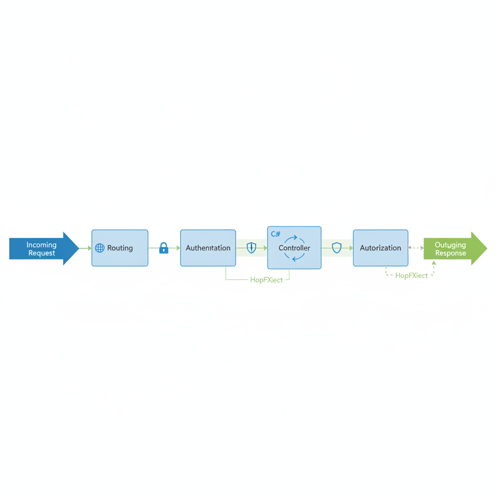

# Welcome to ASP.NET Core: Building Modern Web Applications

Welcome to Module 3 of the Full Stack .NET Development course! In this module, we dive deep into the world of ASP.NET Core, a powerful, open-source, and cross-platform framework for building modern, cloud-based, internet-connected applications. As B-Tech students, understanding ASP.NET Core is crucial for developing robust backend services, particularly Web APIs, which form the backbone of many contemporary software solutions. This lesson serves as your foundational introduction, equipping you with the essential knowledge to navigate and leverage ASP.NET Core effectively.

Throughout this module, our primary focus will be on building Web APIs. This means we'll be concentrating on how to create services that can be consumed by various clients, such as single-page applications (built with Angular, as we'll see later in this course), mobile apps, or even other backend services. ASP.NET Core is exceptionally well-suited for this task due to its performance, flexibility, and extensive feature set.

Learning Objectives for this Lesson:

- Understand the fundamental concepts and architecture of ASP.NET Core.
- Appreciate the cross-platform nature and significant performance benefits offered by ASP.NET Core.
- Become familiar with the typical project structure of an ASP.NET Core application.
- Grasp the concept of the middleware pipeline and its role in request processing.
- Learn the basics of Dependency Injection (DI) and its importance in ASP.NET Core.
- Identify and understand the primary hosting models for ASP.NET Core applications.

Connection to Module Learning Objectives:

This introductory lesson directly supports the module's overarching goals:

- Understand the architecture of ASP.NET Core: We will lay the groundwork by explaining how ASP.NET Core applications are structured and how they process requests.
- Create a basic ASP.NET Core Web API project: While this lesson focuses on concepts, it prepares you for the practical steps involved in project creation by explaining the underlying framework.
- Implement RESTful principles in API design: Understanding the framework's architecture and request handling is the first step towards designing APIs that adhere to RESTful principles.
- Handle HTTP requests and responses: The middleware pipeline and hosting models discussed here are fundamental to how ASP.NET Core manages HTTP communication.

Real-World Relevance:

ASP.NET Core is a cornerstone technology used by countless organizations worldwide to build everything from simple websites and internal tools to complex, high-traffic microservices and enterprise-level applications. Companies like Microsoft, Stack Overflow, and many others rely on ASP.NET Core for their web presence and backend services. Its adoption spans various industries, including finance, e-commerce, gaming, and healthcare, highlighting its versatility and robustness. By mastering ASP.NET Core, you are acquiring a highly marketable skill set that is in demand across the software development landscape.

This lesson will provide you with a solid conceptual foundation. We will then build upon this knowledge in subsequent lessons with practical implementation, code examples, and hands-on exercises using Visual Studio 2022, C#, and the .NET SDK.

## What is ASP.NET Core? A Modern Framework for Web Development

What is ASP.NET Core?

At its core, ASP.NET Core is a free, open-source, cross-platform framework developed by Microsoft for building modern, cloud-ready, internet-connected applications. It is a complete rewrite of the earlier ASP.NET framework, designed from the ground up to address the needs of modern web development, including performance, scalability, and flexibility. It allows developers to build various types of applications, such as:

    Web Applications: Traditional websites with server-side rendering.
    Web APIs: Services that expose data and functionality over HTTP, typically consumed by client applications (like SPAs, mobile apps, or other services).
    Microservices: Small, independent services that can be deployed and scaled individually.
    Real-time applications: Using technologies like SignalR for two-way communication.

Unlike its predecessor, ASP.NET Core is not tied to Internet Information Services (IIS) and can be hosted on various platforms and web servers. It is built on a modular architecture, allowing developers to include only the necessary components, leading to smaller application footprints and improved performance.

Key Characteristics of ASP.NET Core:

    Unified Framework: It combines the features of ASP.NET MVC and ASP.NET Web API into a single programming model. This means you use the same controllers and actions to handle both web pages and API endpoints.
    Open Source and Community-Driven: ASP.NET Core is developed in the open on GitHub, encouraging community contributions and rapid iteration.
    Cross-Platform: It runs on Windows, macOS, and Linux, enabling developers to build and deploy applications on their preferred operating system and target diverse deployment environments.
    High Performance: ASP.NET Core is significantly faster than previous versions of ASP.NET and many other popular web frameworks. This is achieved through various optimizations, including a lightweight HTTP request pipeline and efficient memory management.
    Modular Design: The framework is built using NuGet packages, allowing you to include only the features your application needs. This reduces overhead and improves performance.
    Cloud-Ready: It is designed with cloud deployment in mind, supporting various cloud platforms and patterns like microservices and containerization.
    Testability: The framework's design, particularly its use of Dependency Injection, makes applications easier to test.

Why is ASP.NET Core Important?

In today's technology landscape, web applications and services are ubiquitous. Businesses rely on them for customer interaction, internal operations, data management, and much more. ASP.NET Core empowers developers to build these critical applications efficiently and effectively. Its emphasis on performance means applications can handle more requests with fewer resources, leading to cost savings and a better user experience. The cross-platform nature provides flexibility in development and deployment, allowing teams to work with familiar tools and deploy to cost-effective cloud environments. Furthermore, its modern architecture supports the development of scalable, maintainable, and resilient applications, which are essential for long-term success in the software industry.

For B-Tech students, learning ASP.NET Core is a direct pathway to understanding how modern web backends are constructed. It provides a practical skill set that aligns with industry demands for developers capable of building high-performance, scalable, and maintainable web services and APIs.

Real-World Examples:

Many popular websites and services leverage ASP.NET Core. For instance, the official documentation website for ASP.NET Core itself is built using the framework. Many internal tools and customer-facing applications within Microsoft utilize ASP.NET Core. Beyond Microsoft, numerous companies use it for their e-commerce platforms, content management systems, and backend APIs that power their mobile applications. The framework's adaptability makes it suitable for a wide range of applications, from small startups to large enterprises.

## Cross-Platform Nature and Performance Benefits of ASP.NET Core

The Cross-Platform Advantage

One of the most significant advancements with ASP.NET Core is its cross-platform capability. Unlike the older ASP.NET framework, which was primarily Windows-dependent and tightly coupled with IIS, ASP.NET Core is designed to run on Windows, macOS, and Linux. This fundamental shift offers several compelling advantages:

    Developer Flexibility: Developers can use their preferred operating system for development. Whether you're on a Windows machine, a MacBook, or a Linux workstation, you can build and run ASP.NET Core applications seamlessly. This enhances developer productivity and satisfaction.
    Deployment Diversity: Applications can be deployed to a wide array of hosting environments. This includes on-premises servers running any of the major operating systems, or various cloud platforms like Azure, AWS, Google Cloud, and others. This flexibility allows organizations to choose the most cost-effective and suitable hosting solution for their needs.
    Containerization: The cross-platform nature makes ASP.NET Core an excellent choice for containerization technologies like Docker. You can build a Docker image that runs your ASP.NET Core application on Linux containers, which are often more lightweight and cost-effective than Windows containers. This is a critical aspect of modern microservices architectures.
    Reduced Vendor Lock-in: By not being tied to a specific operating system, organizations can avoid vendor lock-in and leverage a broader ecosystem of tools and services.

Performance Enhancements in ASP.NET Core

Performance is a critical factor in web application development. Users expect fast load times and responsive interfaces, and businesses need applications that can handle high traffic loads efficiently. ASP.NET Core has been engineered from the ground up with performance as a top priority, resulting in significant improvements over previous ASP.NET versions. Key performance benefits include:

    Lightweight HTTP Request Pipeline: ASP.NET Core features a streamlined and highly optimized request pipeline. It avoids the overhead associated with older frameworks by using a simpler, more direct processing model. This pipeline is composed of middleware components, each responsible for a specific task in handling an HTTP request.
    In-Memory Caching: The framework provides efficient in-memory caching mechanisms, allowing frequently accessed data to be stored and retrieved quickly, reducing the need for repeated database queries or expensive computations.
    Optimized Data Structures: ASP.NET Core utilizes efficient data structures and algorithms, contributing to faster processing of requests and responses.
    Reduced Memory Allocation: The framework is designed to minimize memory allocations, which is crucial for high-throughput applications. Less garbage collection pressure means the application can spend more time serving requests.
    Support for Asynchronous Operations: ASP.NET Core fully embraces asynchronous programming patterns (using async and await in C#). This allows the application to handle more concurrent requests by freeing up threads while waiting for I/O operations (like database calls or network requests) to complete, rather than blocking them.
    Kestrel Web Server: ASP.NET Core includes Kestrel, a high-performance, cross-platform web server developed by Microsoft. Kestrel is designed for speed and efficiency and can be used as a standalone server or behind a reverse proxy like Nginx or IIS.

Why Performance Matters:

High performance translates directly into tangible benefits:

    Improved User Experience: Faster applications lead to higher user satisfaction, increased engagement, and reduced bounce rates.
    Scalability: A performant application can handle more users and traffic without requiring expensive hardware upgrades. This means better scalability and lower infrastructure costs.
    Cost Efficiency: By requiring fewer server resources to handle the same workload, ASP.NET Core applications can lead to significant cost savings, especially in cloud environments where resources are billed based on usage.
    Competitive Advantage: In a competitive market, a fast and responsive application can be a key differentiator.

Hands-on Exploration (Conceptual):

While we won't be writing code for performance tuning in this introductory lesson, it's important to be aware of these benefits. When you start building your first ASP.NET Core Web API, you'll be using a framework that is inherently fast and efficient. As you progress, you'll learn techniques to further optimize your application's performance, such as effective caching strategies and asynchronous programming.

The combination of cross-platform flexibility and high performance makes ASP.NET Core a compelling choice for modern web development, enabling developers to build robust, scalable, and efficient applications for a global audience.

## Exploring the ASP.NET Core Project Structure

Understanding the default project structure of an ASP.NET Core application is crucial for navigating your codebase, locating important files, and comprehending how different components interact. When you create a new ASP.NET Core Web API project in Visual Studio, it comes with a well-organized set of files and folders that follow established conventions. Let's break down the typical structure:

Default Project Structure (Web API Example):

Consider a basic ASP.NET Core Web API project. You'll typically find the following key elements:

- Program.cs: This is the entry point of your application. In modern .NET versions (starting with .NET 6), this file is significantly simplified. It contains the CreateHostBuilder method (or directly the WebApplication.CreateBuilder() and app.Run() calls) which configures the host, sets up the web application, and defines the middleware pipeline. It's where your application's lifecycle begins and ends.
- Startup.cs (Older .NET versions, now integrated into Program.cs for .NET 6+): In older versions of ASP.NET Core (.NET 5 and earlier), the Startup.cs file was central to application configuration. It contained two key methods:

    - ConfigureServices(IServiceCollection services): This method is used to register services (like databases, authentication, MVC, etc.) with the application's dependency injection container.
    - Configure(IApplicationBuilder app, IWebHostEnvironment env): This method is used to configure the HTTP request pipeline by adding middleware components.

- For .NET 6 and later, these configurations are largely moved into Program.cs, making the startup process more streamlined.
- Controllers/ Folder: This directory typically houses your API controllers. Controllers are classes that handle incoming HTTP requests, process them, and return HTTP responses. For a Web API project, these controllers will often inherit from ControllerBase and contain methods (actions) that map to specific HTTP verbs (GET, POST, PUT, DELETE) and routes.

- Models/ Folder: This folder is used to store your application's data models. These are typically Plain Old C# Objects (POCOs) that represent the data your API will work with (e.g., a Product model, a User model). These models are often used for request and response payloads.
- Properties/ Folder: Contains project-specific properties, including launchSettings.json.
- launchSettings.json: This file defines settings for how your application is launched during development, including the URLs it will listen on and environment variables. It's crucial for debugging and running your application locally.
- appsettings.json: This file stores configuration settings for your application, such as database connection strings, logging levels, and other application-specific parameters. It's part of ASP.NET Core's flexible configuration system.
- .csproj File (e.g., YourProjectName.csproj): This is the project file that defines your project's metadata, dependencies (NuGet packages), build configurations, and other project settings.
- wwwroot/ Folder (for Web Applications, less common for pure APIs): If you are building a web application that serves static files (HTML, CSS, JavaScript, images), this folder is used to store them. These files are directly accessible via HTTP.

Hands-on Component: Exploring the Default Project Structure

Let's walk through how to explore this structure:

- Create a New Project: Open Visual Studio 2022. Select 'Create a new project'. Search for 'ASP.NET Core Web API' and select the template. Click 'Next'.
- Configure Project: Give your project a name (e.g., MyFirstApi) and choose a location. Click 'Next'.
- Additional Information: Select the desired .NET framework version (e.g., .NET 6.0 LTS or later). Ensure 'Use controllers' is checked (for a controller-based API). You can leave 'Enable OpenAPI support' checked, as it's useful for testing. Click 'Create'.
- Examine the Solution Explorer: Once the project is created, look at the 'Solution Explorer' pane in Visual Studio. You will see the folders and files mentioned above.
- Open Program.cs: Double-click on Program.cs to open it. Observe the simplified structure. You'll see calls to WebApplication.CreateBuilder(args), configuration of services using builder.Services, and configuration of the request pipeline using app.MapControllers() and app.Run().
- Inspect the Controllers Folder: Expand the Controllers folder. You'll likely find a default controller, such as WeatherForecastController. Open it to see how it's structured with actions (methods) decorated with attributes like [HttpGet].
- Review launchSettings.json: Locate the Properties folder and open launchSettings.json. Examine the different profiles (e.g., 'IIS Express', 'YourProjectName') and note the applicationUrl settings, which define the local URLs your API will be accessible at.
- Check appsettings.json: Open appsettings.json. You'll see basic configuration for logging.

By familiarizing yourself with this structure, you'll be well-prepared to add your own controllers, models, and configurations as you build out your Web APIs.

## The ASP.NET Core Middleware Pipeline: Handling Requests

The middleware pipeline is a fundamental concept in ASP.NET Core that dictates how HTTP requests are processed. Think of it as a series of components, or 'middleware', arranged in a specific order. Each component has the opportunity to act on an incoming request and/or an outgoing response. This modular design provides immense flexibility and control over the request processing flow.

What is Middleware?

Middleware is essentially software that is assembled in an application pipeline to handle requests and responses. Each piece of middleware can:

    Execute code before the next middleware in the pipeline.

    Execute code after the next middleware in the pipeline.

    Short-circuit the pipeline (i.e., not call the next middleware).

    Pass the request on to the next middleware in the pipeline.

Common examples of middleware include:

    Static File Middleware: Serves static files (HTML, CSS, JS, images) from the wwwroot folder.

    Routing Middleware: Determines which endpoint should handle the request based on the URL.

    Authentication Middleware: Checks the identity of the user making the request.

    Authorization Middleware: Verifies if the authenticated user has permission to access the requested resource.

    MVC/API Controller Middleware: Executes the logic defined in your controllers and actions.

    Error Handling Middleware: Catches exceptions and generates appropriate error responses.

    CORS (Cross-Origin Resource Sharing) Middleware: Enables web applications running on one domain to access resources from a different domain.

How the Pipeline Works:

When an HTTP request arrives at your ASP.NET Core application, it enters the pipeline at the beginning and travels sequentially through each middleware component. Each middleware component receives a context object (HttpContext) that contains information about the request and allows the middleware to modify the response. The HttpContext object is passed from one middleware to the next.

The pipeline is typically configured in the Program.cs file (or Startup.cs in older versions) using the IApplicationBuilder interface. The order in which middleware is added is critical, as it defines the processing sequence.

Example of Pipeline Configuration:

In Program.cs (for .NET 6+), you'll see something like this:

    var builder = WebApplication.CreateBuilder(args);

    // Add services to the container.
    builder.Services.AddControllers(); // Adds MVC/API controllers and related services

    var app = builder.Build();

    // Configure the HTTP request pipeline.
    if (app.Environment.IsDevelopment())
    {
        app.UseDeveloperExceptionPage();  // Shows detailed error pages in development
        app.UseSwagger();                  // Enables Swagger UI for API documentation
        app.UseSwaggerUI();                // Configures Swagger UI
    }

    app.UseHttpsRedirection();           // Redirects HTTP requests to HTTPS
    app.UseRouting();                    // Enables routing to match requests to endpoints
    app.UseAuthentication();             // Adds authentication middleware
    app.UseAuthorization();              // Adds authorization middleware

    app.MapControllers();                 // Maps requests to controller actions

    app.Run();                           // Runs the application

In this example:

    app.UseDeveloperExceptionPage() is placed early to catch errors during development.

    app.UseHttpsRedirection() ensures secure connections.

    app.UseRouting() is essential for the routing middleware to work.

    app.UseAuthentication() and app.UseAuthorization() are typically placed after routing but before endpoint execution.

    app.MapControllers() is often one of the last steps, mapping requests to your API controllers.

Hands-on Component: Discussing Middleware in Request Processing

Let's consider a practical scenario:

    Request Arrives: A user's browser sends an HTTP GET request to /api/products.

    UseRouting(): The request enters the pipeline. The UseRouting() middleware analyzes the URL (/api/products) and determines that it should be handled by a controller action. It populates the HttpContext.Request.RouteValues with information like the controller name ('Products') and action name ('Get').

    UseAuthentication(): If authentication is configured, this middleware might check for a JWT token in the request headers. If valid, it identifies the user.

    UseAuthorization(): This middleware checks if the identified user has the necessary permissions to access the 'Products' controller and its 'Get' action.

    MapControllers(): This middleware takes the routing information and invokes the appropriate controller action (e.g., a method named Get() within the ProductsController).

    Controller Action Execution: Your Get() method in the ProductsController executes. It might query a database for product data.

    Response Generation: The controller action returns a result, typically an OkObjectResult containing a list of products in JSON format.

    Pipeline Reversal (Conceptual): The response now travels back up the pipeline (conceptually). For instance, if there was middleware to log responses, it would execute here. The final response is sent back to the browser.

Why is the Middleware Pipeline Important?

The middleware pipeline provides a clean, organized, and extensible way to handle requests. It allows you to:

    Add or remove functionality easily: You can simply add or remove middleware components to change your application's behavior (e.g., add CORS support, enable authentication).

    Control the request flow: The order of middleware is crucial and allows you to define the exact sequence of operations.

    Promote Reusability: Many middleware components are reusable across different ASP.NET Core applications.

    Enhance Security: Middleware is used for critical security functions like authentication and authorization.

Understanding the middleware pipeline is fundamental to building secure, efficient, and feature-rich ASP.NET Core applications.

